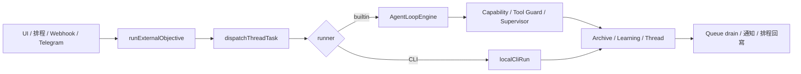
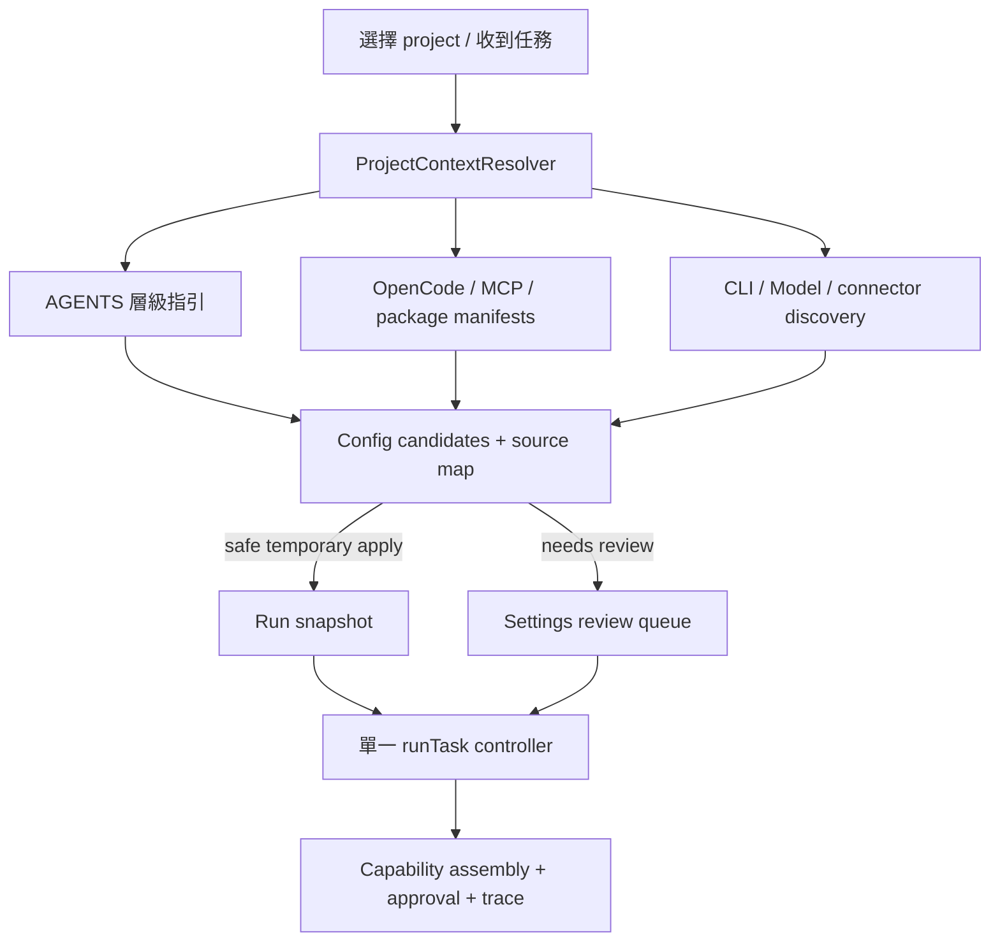

# SubAgents AI 工作流對齊稽核（Agent 視角・對標 Codex App）

> 稽核日期：2026-07-11  
> 範圍：`app/src/`、`app/electron/`、既有 smoke/E2E 與設定/外掛/自動化資料流  
> 性質：靜態接線稽核＋既有測試覆蓋盤點；不是 Codex 功能清單的逐項複製計畫。

## 1. 結論

專案的 agent 核心已相當完整：四種 loop、capability 漸進披露、Tool Search、CodeMode、HITL、跨 run capability 恢復、排程/Webhook/Telegram FIFO 補跑、附件、MCP、Marketplace 與 OAuth 均已有落點。

真正的問題不在「缺少更多按鈕」，而在 **控制平面沒有完全收斂**。目前有些入口、專案指引、設定來源與憑證儲存各自可用，卻沒有全部經由同一個可稽核的解析與執行契約。這會在功能持續增加時形成 drift：同一個任務由不同入口觸發，得到不同的佇列、上下文、設定或審計結果。

最高優先的三項是：

1. 將所有任務入口收斂到一個 `runTask` lifecycle controller。
2. 建立 project context resolver，真正自動載入專案 `AGENTS.md` 與已支援設定的可執行部分。
3. 把「偵測到的設定」改為有來源、可預覽、可逐項採用的 candidates，而非散落的手動匯入與字串 heuristics。

這樣的方向與 Codex 的設計概念一致：專案指引、記憶、skills、MCP 與 subagents 是互補的上下文層，而不是彼此競爭的功能。見 [Customization](https://learn.chatgpt.com/docs/customization/overview) 與 [AGENTS.md guidance](https://learn.chatgpt.com/docs/customization/overview#agents-guidance)。

## 2. 對標範圍與判定原則

Codex App 是參考架構，不是本專案必須一比一實作的規格。本稽核以「一個 agent 能否可靠完成工作」為判定標準：

| 對標軸 | 本稽核要求 |
|---|---|
| 任務生命週期 | 所有入口都必須產生相同的 run id、狀態、審批、佇列、thread 與 archive 語意。 |
| 專案脈絡 | 已選 project 後，持久指引與設定要自動、可追溯、可覆寫地生效。 |
| 工具與整合 | 能力包、MCP、connector、技能與權限要由同一份可解釋的啟用狀態決定。 |
| 自動化 | 排程必須能承接 thread context、skills、工具/模型選擇，並可重試與檢視。 |
| 安全與治理 | 憑證不應暴露在 renderer 可讀的持久化區；副作用必須有明確分類與審計。 |
| 可驗證性 | 重要呼應關係要由實際 scenario test 防退化，不能只靠 source grep 或鏡射函式。 |

Codex 的公開文件將 project guidance、skills、MCP、subagents 視為互補層；其 config 也以 project root 向上發現設定/`AGENTS.md`，並支援 lifecycle hooks。[官方 customization 說明](https://learn.chatgpt.com/docs/customization/overview)、[advanced config：hooks 與 project root detection](https://learn.chatgpt.com/docs/config-file/config-advanced#hooks)。

## 3. 現況：已接通且值得保留的骨架



下列能力已有可信落點，後續重構應保留，不要另起平行機制：

- `runExternalObjective` 處理附件 materialize、busy queue、thread/bubble、unattended、完成後 drain 與排程 callback。
- `dispatchThreadTask` 統一 builtin/CLI 的 model、project root、附件、thread capability 恢復與 intent preload。
- capability runtime 已把 builtin/skill/MCP/user tools 組成同一個執行面，並支援 deferred loading、Tool Search、approval tools 與 `blockedTools`。
- `runQueue` 已將自動化任務序列化、持久化、去重、重啟後補跑；排程 job 可重新綁定結果回寫。
- Marketplace connector 以 declarative custom tools 接上既有 authorization/supervisor；OAuth refresh 亦有 bootstrap。
- `npm run smoke` 現已包含 marketplace E2E；build 與 smoke 是可用的最基本回歸閘門。

## 4. 已確認缺口

### W1・任務入口尚未真正統一（P0）

**證據**

- `app/src/agent/runExternal.ts` 是唯一同時處理 queue、附件、thread lifecycle、unattended 與 drain 的完整入口。
- 但 `ProtocolsPage.tsx:334` 與 `useSlashExecutor.ts:75` 直接呼叫 `dispatchThreadTask`，並在 UI 內手動複製 bubble、status、run panel 與錯誤流程。
- `dispatchThreadTask` 遇到 busy 直接失敗；只有 `runExternalObjective` 決定何時把工作放入 FIFO。

**影響**

同一任務從 composer、slash command、排程或 Webhook 進入時，可能使用不同的 queue、bubble、取消後 drain、source metadata 與完成 callback 語意。這已違反既有 `WORKFLOW_AUDIT.md` 所宣告的「所有入口統一管線」，也是未來最容易再長出漏接的地方。

**處置**

建立唯一 `runTask(input)` controller，將 `runExternalObjective` 泛化為所有來源的入口；來源只影響 `sourceKind`、`unattended`、是否新建/reuse thread、queue policy，而不是自行拼 lifecycle。UI/slash 只負責輸入與呈現 controller 的 state。

**驗收**

- composer、`/run`、retry、schedule、webhook、Telegram、background delegate 全部只可經 controller 進入。
- 每個 run 產生 `runId`，Archive、thread、HITL、queue item、notification 都可用它關聯。
- busy 時每個入口的結果（queue / steer / reject）由 declarative policy 表決定，並有 table-driven test。

### W2・選定 project 後，真正的 `AGENTS.md` 沒有被載入（P0）

**證據**

- `promptBuilder.ts:74-82` 的 `agentsDoc` 是記憶體字串；`buildPromptLayers()` 只注入這份字串（:137-141）。
- `learningStore.ts` 只從 Hermes payload/localStorage 設定 `agentsDoc`；`opencodeBridge.ts` 載入的是 `opencode.json[c]`、agents 與 commands，沒有讀取專案 `AGENTS.md`。
- UI 可用 slash 產生/寫入 `AGENTS.md`，卻沒有相反方向的 project-root 讀取與變更重新解析。

**影響**

repo 的 build/test 指令、目錄規則、review expectations 雖已存在，builtin agent 仍可能看不到；切換 project 亦可能沿用上一個 workspace 的 Herm​​es 指引。這是 agent 最核心的「做事前先理解專案」缺口。

**處置**

新增 `projectContextResolver`：

1. 從實際 cwd/project root 向上找 root `AGENTS.md`，並依檔案路徑疊加較近子目錄指引。
2. 將其與 user/Hermes guidance 分層，而非覆蓋；明定優先序：managed policy > project local > user profile > thread instruction > learned memory。
3. 回傳 `AppliedContext[]`（path、hash、scope、bytes、priority），寫入 run snapshot/Archive；project 切換與檔案變更時失效重算。
4. 預設只讀、只注入文字；過大檔案需裁切與 UI 顯示「已裁切」。

Codex 將 `AGENTS.md` 定義為 task 開始前生效、隨 repo 流通的持久 project guidance，並建議將目錄專屬規則放在最近的目錄。[官方 AGENTS guidance](https://learn.chatgpt.com/docs/customization/overview#agents-guidance)。

### W3・OpenCode 設定只「解析一部分」，沒有完整投影到 runtime（P0）

**證據**

- `configLoader.ts` 會解析 `model`、`small_model`、`default_agent`、`permission`、`agent`、`command`、`mcp`、`instructions` 與 `compaction`。
- `opencodeConfigStore.ts:102-128` 只將 agents/commands 寫入 registry/store 可見 state；`mcp` 與 `instructions` 沒有投影到 Settings、MCP runtime 或 `promptBuilder`。
- `small_model`/`compaction` 已由 agent registry/compaction 消費，說明問題不是 parser，而是 projection contract 不完整。

**影響**

使用者會以為匯入 `opencode.jsonc` 後所有工作設定都生效，實際只有部分欄位生效。尤其 `instructions` 與 `mcp` 是最影響 agent 行為與工具庫的兩個欄位，卻容易靜默失效。

**處置**

把 OpenCode/本機設定解析改成 `DiscoveredConfigCandidate[]`，每筆有 `field`、`value`、`source`、`trust`、`compatibility`、`applyMode`：

- 可安全暫時套用：project instructions、project model hint、compaction hint。
- 必須人工採用：MCP server、寫入權限放寬、外部 URL、secret reference。
- 不支援的欄位：在 Settings 的「匯入報告」顯式列出，不可沉默略過。

切忌把發現到的設定直接寫回全域 Settings；應可預覽 diff、逐項採用、復原，並在 run snapshot 留下來源。

### W4・模型偵測只有 model id，沒有 capability profile（P1）

**證據**

- `settingsStore.testConnection()` 取得 `/models` 後只存 `discoveredModels: string[]`，並以一次普通 chat probe 判斷連線。
- Function calling、vision、max context、JSON/structured output、streaming 等能力仍由全域開關或 model-id 名稱 heuristic 決定。
- `modelTuning.ts` 能依 model 名稱調整 tool budget，但沒有「此模型是否真的支援 vision/tool calls」的可驗證來源。

**影響**

設定畫面可以自動列出模型，卻不能可靠自動帶入 FC、vision、tool rounds、payload budget 或角色模型建議。使用者選到不支援的模型時，錯誤會延後到任務執行才浮現。

**處置**

新增 `ModelProfile` 與 capability probe：

- 基礎欄位：provider/source、model id、context window（若可信來源可得）、tools、vision、stream、structured output、reasoning、last verified。
- 預設先採保守值；只有使用者執行「驗證能力」或 provider metadata 明示時才更新，不用未知測試自動花費額度。
- UI 對每個模型顯示「已驗證／推測／未知」，並提供一鍵套用安全的 tool/vision/role 建議；thread 將選定 profile snapshot 化。

### W5・Connector token 仍在 renderer `localStorage`（P1・安全與可靠性）

**證據**

- `pluginSecrets.ts:1-43` 明確把 PAT/access token/refresh token 存到 `subagents.plugin-secrets.v1` 的 `localStorage`。
- Electron main 已對 `customToolSecrets` 使用 `safeStorage`，兩種秘密的儲存邊界不一致。

**影響**

匯出確實不帶 connector token，但 desktop renderer 的 localStorage 不是 OS credential vault；任何 renderer 內的 XSS、意外 debug dump 或 browser fallback 都有更大的 token 暴露面。refresh token 亦與 access token 同處。

**處置**

將 plugin secrets 移到 main process：優先用 OS credential vault（或 Electron `safeStorage` 加密檔）並只暴露最小 IPC：`hasSecret`、`storeSecret`、`clearSecret`、`useSecretForRequest`。renderer 只能讀 metadata（授權狀態、到期時間、account hint），不能讀 token。遷移時讀一次舊 localStorage、寫入 vault 後清除，並提供失敗回復提示。

### W6・工具庫有「市集」，但缺少可擴張的工具治理與健康契約（P1）

**證據**

- `pluginCatalog.ts` 與 `connectorTools.ts` 已出貨 11 家 connector；`customTools.ts` 也安全限制為 http/bash template。
- `pluginRegistry.loadFromArray()` 主要以 manifest 結構載入，沒有 schema version、能力宣告、permission class、health-check contract 或可追蹤 upgrade/migration 的統一驗證層。
- 現有 `requiresApproval` 可標註個別工具，但缺少以「read / write / destructive / external side effect」為一等欄位的宣告與 UI 差異檢視。

**影響**

增加第 12 個 connector 時仍要手工維護 catalog、template、OAuth、secret owner、MCP env、intent keywords、approval 與 E2E；工具量一大就會再次出現 wiring drift。使用者也難在安裝前理解一個 plugin 會讀/寫什麼系統。

**處置**

建立 versioned `ToolPackageManifest`，以 schema 驗證後編譯為 custom tools / MCP / capability：

- 每個 tool 必填 `operationClass`、`sideEffect`、`auth`、`idempotency`、`inputSchema`、`outputLimit`、`healthCheck`。
- 支援 OpenAPI 精選匯入與 MCP discovery，但一律先產生 reviewable draft；寫入/刪除操作預設 ask。
- 在 Marketplace 顯示 scopes、讀寫能力、token owner、健康狀態、版本與最近驗證時間。
- 在安裝/更新前顯示 manifest diff；不因更新靜默增加寫入工具或 scope。

Codex 的 plugin 結構把 manifest、skills、MCP、connectors 與 hooks 視為可組合元件，並以 marketplace metadata 管理安裝面；可借鏡其「manifest 為單一入口、元件可獨立審核」的方向，而不需要相容其檔案格式。[Build plugins](https://learn.chatgpt.com/docs/build-plugins#plugin-structure)。

### W7・缺少 lifecycle extension point 與真實端到端驗證（P1）

**證據**

- 安全檢查集中在 `toolGuard`/`supervisor`，但沒有可宣告的 `BeforeRun`、`BeforeTool`、`AfterTool`、`AfterRun` hook contract；外掛也不能在受控點加入組織 policy/驗證。
- `smoke-caps.mjs` 為了 plain Node 執行而鏡射部分 runtime 邏輯，並做 source regex 契約；它很適合防靜態 drift，卻不能證明 renderer → preload → main → store → engine 的完整行為。
- marketplace E2E 已補上，但尚未覆蓋「project 指引切換、busy queue、重啟恢復、HITL timeout、Archive 關聯」這條完整主線。

**處置**

1. 建立受控 hook API（純資料決策優先，不允許 renderer 任意 JS）：`beforeRun` 可補 context/拒絕；`beforeTool` 可要求核准/拒絕；`afterTool` 可記錄；`afterRun` 可做通知/品質 gate。hook 與 plugin 分開信任、可 timeout、可審計。
2. 建立 scenario E2E，使用 fake LLM/fake MCP/fake clock/fake Electron bridge，驗證下方第 7 節的流程矩陣。
3. 將 Archive 改為每 run 的 canonical trace：來源、解析後 context、設定 profile、capability/tool lifecycle、approval decision、retry/queue lineage、驗證結果。

Codex 以 project/user/config layers 載入 hooks，並把 hook 執行與工具/MCP/approval metrics 納入可觀測範圍；本專案可採相同的「受控 lifecycle、可審計」原則。[Hooks / project config](https://learn.chatgpt.com/docs/config-file/config-advanced#hooks)。

## 5. 自動載入與自動帶入：目標架構



### 5.1 建議來源與採用規則

| 來源 | 自動讀取 | 自動套用 | 必須人工確認 |
|---|---|---|---|
| root/nearest `AGENTS.md` | 是 | 是，作為本 run context | 過大、衝突或不可信 project 時 |
| OpenCode `instructions`、agent/permission/compaction | 是 | instructions/compaction 僅本 run 暫時套用 | permission 放寬、model 覆蓋 |
| `.mcp.json`、OpenCode MCP | 是 | 否 | server enable、network URL、env/secret mapping |
| `package.json`、lockfile、`pyproject.toml`、`Cargo.toml` 等 | 是 | 僅產生 read-only project facts/建議 commands | 寫入/安裝 dependencies |
| CLI settings / model list | 是（explicit scan/test） | 只寫 discovered profile | 預設模型與 role assignment |
| connector OAuth / PAT | 否（必須使用者啟動） | token 僅進 vault | scopes、寫入型 connector 啟用 |

### 5.2 Settings 的資料模型

以 `SettingSpec` 取代「types + DEFAULT + SettingsPage + merge 各改一次」的分散約定。每個 setting 需宣告：

```ts
type SettingSpec<T> = {
  key: string
  default: T
  scope: 'global' | 'project' | 'thread' | 'run'
  sensitivity: 'normal' | 'secret'
  sourcePolicy: 'manual-only' | 'discoverable' | 'temporary-discovery'
  validate(value: unknown): T
  merge(current: T, candidate: T): T
}
```

好處是：UI 表單、persist/export redaction、runtime resolver、import preview、migration 與測試都從同一份規格得知欄位屬性。秘密不能出現在 export candidate；project 發現值不會意外覆蓋全域偏好。

## 6. 建議交付順序 — 實作狀態（2026-07-11）

| 階段 | 工作 | 狀態 | 完成證據 |
|---|---|---|---|
| P0-A | `runTask` controller 與 run id/trace | ✅ 已實作 | `runExternal.ts`：`runTask` + `RunSourceKind` + `resolveBusyPolicy` 表；ProtocolsPage/useSlashExecutor 改走 controller；9 個入口檔案零直呼 `dispatchThreadTask`（smoke drift guard 把關）；`runId` 進 overrides → engine `state.id` → Archive/queue 持久化 |
| P0-B | `projectContextResolver` + AGENTS hierarchy | ✅ 已實作 | `project:agentsDocs` IPC（唯讀、名單制 AGENTS.md/CLAUDE.md、24KB 上限、.git 邊界、向上 3 層）→ `agent/projectContext.ts`（hash/bytes/truncated 的 `AppliedContext`、TTL cache）→ engine 每 run 解析 + 審計 log → `buildPromptLayers.projectGuidance`（優先於 Hermes 使用者指引） |
| P0-C | OpenCode config candidate/projection report | ✅ 已實作 | `configCandidates.ts`：每欄位三擇一（temporary/review/unsupported）；instructions 每 run 暫時套用（engine 注入 + log）；MCP/model 需 Settings「匯入報告」按「採用」；不支援欄位顯式列出 |
| P1-A | credential vault migration | ✅ 已實作 | `electron/secretsVault.ts`（safeStorage 加密檔）+ 最小 IPC（list=metadata only / store / clear / refresh）；`{{secret:key}}` 於 main 解析（tools:httpRequest、mcp:httpRpc、mcp stdio spawn env/args）；renderer `getPluginSecret` 在 Electron 一律回 null；localStorage 一次性遷移後清除；refresh_token 不出 main；customToolSecrets 鏡射已移除 |
| P1-B | `ModelProfile` + 安全探測 | ✅ 已實作 | `agent/modelProfile.ts`：verified 僅來自使用者顯式「驗證模型能力」（tools/JSON/vision 三次極小呼叫）；assumed 來自 model-id 啟發；engine 依 profile **先行降級**（tools=false → heuristic、vision=false → 圖片轉路徑註記，皆記 log）；Settings 顯示 已驗證/推測/未知 徽章 |
| P1-C | ToolPackageManifest + health | ✅ 已實作 | `agent/tools/toolPackage.ts`：schemaVersion + 每工具必填 `operationClass`；權限面 fingerprint — 未核准的 write/destructive/bash 工具**暫扣**（read-only 面照常編譯進既有 custom-tool 管線）；更新升權 → fingerprint 變 → 需重審；health check 契約 + Settings「權限審核」UI |
| P1-D | hook API + scenario E2E | ✅ hook API 已實作 ／ ◐ E2E 部分 | `agent/hooks.ts`：宣告式規則（純資料，無外掛 JS），四掛點 beforeRun/beforeTool/afterTool/afterRun；只能限制/觀察（無 allow 動作），`require-approval` 連 approvalMode full 也攔；每條觸發規則寫入 run log 審計；plugin hooks 經 sanitize。E2E：hook 評估矩陣 + 四掛點接線契約進 smoke（28 則）；fake-bridge 全流程 scenario 尚未建（見 §7 殘餘） |

## 7. 必須進 CI 的工作流矩陣

| 情境 | 必驗證的呼應關係 |
|---|---|
| Composer / `/run` / retry | 同一 controller、同一 run trace、相同 thread/bubble/archive 語意 |
| busy 後 user follow-up、Webhook、排程 | policy 決定 steer/queue；FIFO、dedupe、completion callback 與通知都正確 |
| App 重啟後 queue | attachment file path、schedule job rebind、project root、unattended policy 未遺失 |
| 切換 project A → B | A 的 AGENTS/instructions/skills 不殘留；B 的 source map 正確 |
| OpenCode config import | 每個欄位被 temporary apply、requires review 或 unsupported 三擇一，無靜默 drop |
| 選擇 model + image + tool task | 不支援的 vision/tool 能力在執行前被標示或安全降級 |
| connector OAuth refresh + MCP | raw token 不到 renderer/export；refresh 後 MCP session 重新載入 secret |
| plugin update | 新增 write/destructive tool 或 scope 時要求重新 review，side-effect classification 不可漏 |
| HITL timeout / abort | tool、run、queue、archive 的 final status 一致，不重複 notify/drain |

## 8. 不建議現在做的事

- 不要為了「對標 Codex」直接複製 `.codex-plugin`、`config.toml` 或任何私有格式；先定義本專案的 source/precedence/permission 契約。
- 不要把專案設定與自動偵測結果直接覆寫全域 Settings；必須保留 source 與採用決策。
- 不要再為每個 connector 增加另一條 executor/approval 路徑；所有工具必須編譯回既有 capability + `authorizeTool` + supervisor。
- 不要只增加 smoke regex；P0 完成後以 fake bridge 的 scenario E2E 守住真正的端到端流程。

## 9. 稽核依據與限制

- 以 source-level data-flow tracing、既有 smoke/E2E scripts 與目前 build/test contract 為依據；未呼叫真實第三方 OAuth、MCP 或 LLM。
- Codex 公開文件在本稽核中只用於架構方向：project guidance、skills、MCP、subagents、hooks、marketplace、automations；不宣稱本專案應具備所有 Codex surface。
- 官方對 scheduled task 的建議是先在一般 task 測 prompt，再讓排程繼續同一 task context，並在前幾次結果中調整工具/模型/節奏；這正是本文件要求 schedule scenario E2E 與 run snapshot 的原因。[Scheduled tasks](https://learn.chatgpt.com/docs/automations?surface=app)。

