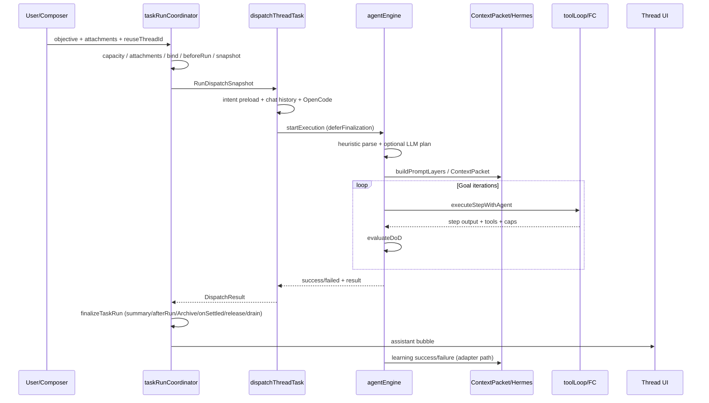

# 對話任務送出：執行流程 × Loop Engineering × Hermes 缺口與改善

> **視角**：以 **Hermes Agent**（穩定 loop、skills、memory、prompt 分層、學習閉環）與 **Loop Engineering**（規格 `docs/01~03`：Parse → Pattern → Validate → Iterate/Terminate）審視「使用者在對話介面送出一則任務」時的實際管線。  
> **範圍**：互動對話入口（Protocols 對話 composer / 斜線指令），不展開排程／Webhook／Telegram 的差異細節（它們共用同一 `runTask`，但政策不同）。  
> **對照基準**：程式現況（2026-07-14：`taskRunCoordinator` + ContextPacket + runner capability matrix 已落地）+ 規格 01/02/03 + **`docs/TASK_AGENT_WORKFLOW_INTEGRATION_PLAN_2026-07-14.md`（Phases 0–5 完成）** + `LOOP_HERMES_GAP_PLAN.md` / `WORKFLOW_AUDIT.md`。  
> **產物用途**：給實作者與稽核者共用的「對話路徑現況圖 + 仍須補的流程 + 優先改善清單」。

---

## 0. 一句話結論

對話送出後，**lifecycle 已收斂到 `taskRunCoordinator.runTask`**（capacity／附件／thread／beforeRun 一次；`dispatchThreadTask(snapshot)` 只選 runner；`finalizeTaskRun` 唯一收尾），Hermes 的 **ContextPacket**／技能／記憶／學習已掛線；Time/Proactive **不可**由對話純文字觸發。從 **Loop Engineering** 看，builtin 路徑已有 Parse／DoD／iterate／Next_State consumer；**外部 CLI** 誠實宣告無 DoD/continueGoal。對話預設仍偏 Goal-based 多步（可 chat-lite Turn）；並行為 **預設關、可設定上限**（ADR-0003）。

---

## 1. 視角定義

### 1.1 Loop Engineering（規格驅動）

| 階段 | 規格要求 | 成功判準 |
|------|----------|----------|
| **Receive** | 明確 Trigger | 一則 user bubble / slash / 附件 對應一次 run |
| **Parse** | 規格 03 MUST 結構化 | `Loop_Type` + Sequence + **可量測 DoD** + Max_Iter + Fallback + Next_State |
| **Classify** | 規格 02 四模式 | Turn / Goal / Time / Proactive 約束互斥 |
| **Execute** | 逐步 + 工具證據 | FC / heuristic / simulation 皆可降級 |
| **Validate** | 對 DoD 自評 | Goal：未達標不得當成功；禁止 partial-met 即終止 |
| **Iterate** | 有修正訊號 | 不是空轉重跑；缺什麼補什麼 |
| **Terminate** | 成功 / 失敗 / 等人 | Next_State 可被 UI 消費 |

### 1.2 Hermes Agent（可移植核心）

| 核心 | 在對話 run 中的角色 |
|------|---------------------|
| **Agent Loop** | 穩定 system → tool_calls → 回圈（本專案 = engine + `toolLoop`） |
| **Prompt 分層** | stable（soul/skills）→ context（AGENTS.md）→ volatile（memory/time） |
| **Skills** | 意圖命中 → preload `skill:*`；成功後草稿 → 人工核准 |
| **Memory** | 跨對話偏好／教訓；volatile 注入 + 工具讀寫 |
| **Learning** | 成功草稿技能、失敗寫教訓、週期 nudge |
| **Delegate** | 隔離 leaf；對話主 run 可 `delegate_task` |
| **Session 召回** | 跨 session top-k（failure-first）→ ContextPacket `sessionRecall` slot（temporary 跳過） |
| **ContextPacket** | 固定 slot／優先序／`includedChars` diagnostics（取代整段 extraContext 最後裁切） |

### 1.3 Trigger 與 runner 約束（2026-07-14）

| 規則 | 說明 |
|------|------|
| 對話 auto loop | 僅 Turn-based / Goal-based；cron/event 語意 → `AutomationSuggestion`，不進 tools |
| Time-based | 僅 claimed `ScheduledJob` + `scheduleTrigger` snapshot |
| Proactive | 僅 `eventMatcher` 布林 evidence；不可從 objective 猜 when/if |
| 並行 | 預設 `concurrentRunsEnabled=false`；opt-in 後 `maxConcurrentRuns` 上限 |
| Builtin vs CLI | 見 `agent/runners/` matrix；CLI 無 parse/DoD/iterate/continueGoal |

詳見 **`docs/TASK_AGENT_WORKFLOW_INTEGRATION_PLAN_2026-07-14.md`**。

---

## 2. 對話任務送出：現行執行流程

### 2.1 入口與單一管線

```
[ProtocolsPage CommandComposer]
        │  onSubmitLine(line, attachments)
        ▼
 runEmbedded()  ─── sourceKind: 'composer'
        │  • subagent mention bubble / temporary 提示
        ▼
 taskRunCoordinator.runTask()     ← 唯一 canonical ingress
        │  (唯一 ingress 與 lifecycle owner)
        ├─ empty objective？→ fail
        ├─ automation suggestion？（composer/slash 排程語意）→ bubble only
        ├─ capacity check/reserve（opt-in concurrent cap）
        │     busy → steer / queue / reject（resolveBusyPolicy）
        ├─ attachments persist → hydrate（各一次）
        ├─ bindRunThread + user bubble
        ├─ beforeRun hooks
        ├─ buildRunDispatchSnapshot（deferFinalization）
        └─ dispatchThreadTask(snapshot)   ← 只選 runner、組 context
                 │
                 ├─ external → localCliRun（executionKind=external）
                 └─ builtin → startExecution → agentEngine.start()
        ▼
 finalizeTaskRun：summary → afterRun → Archive → onSettled → release → drain
```

斜線指令（`useSlashExecutor` → `runEmbedded`）路徑相同，差異僅 `sourceKind: 'slash'` 與部分指令預先寫 bubble。

**錨點檔案**

| 階段 | 檔案 |
|------|------|
| UI 送出 | `app/src/pages/ProtocolsPage.tsx` `runEmbedded` |
| Composer | `app/src/components/CommandComposer.tsx` |
| Slash | `app/src/hooks/useSlashExecutor.ts` |
| Lifecycle | `taskRunCoordinator.ts` `runTask` → `taskRunExecution.ts` → `taskRunLifecycleSupport.ts` `finalizeTaskRun` |
| Task run internals | `taskRunContracts.ts` → `taskRunExecution.ts` → `taskRunLifecycleSupport.ts`（產品 caller 不得匯入） |
| Busy 政策 | `resolveBusyPolicy`（composer/slash → steer/queue） |
| 分派 | `app/src/agent/runDispatch.ts` `dispatchThreadTask(snapshot)` |
| Runner matrix | `app/src/agent/runners/types.ts` |
| 引擎 | `app/src/agent/engine.ts` `start` / `executeStepWithAgent` |
| 結束寫回 | `finalizeTaskRun`；Archive／onSettled／drain 各一次 |

### 2.2 對話送出時的「準備層」（dispatch 前半）

在進 engine 前，對話 run 會組好一層 **RuntimeOverrides** 與意圖資產：

```
objective text
    │
    ├─ parseSubagentMentions / parseRegistryMentions  → @explore / @general…
    ├─ openCodeRuntimeOverrides(agentMode, model, depth, speed, subagent)
    │     build vs plan 權限政策、blockedTools
    ├─ buildIntentPreloadIds(text)  → capability 候選（builtin / skill / mcp / project）
    ├─ thread.lastCapabilityIds / lastUnlockedTools  → 跨 run 恢復
    ├─ referenceChatHistory（近 12 則 user/assistant）→ extraSystemContext
    ├─ attachments → 文字附錄 + vision dataUrl / 路徑
    ├─ temporary / unattended(false for composer) / runId
    └─ forceLoopType = opts.loopType || thread.loopType || 'Goal-based'
```

**對話特有預設**

| 項目 | 預設 | 影響 |
|------|------|------|
| `sourceKind` | `composer` / `slash` | 忙碌時 **steer 或 queue**（非 automation 的強制 queue） |
| `unattended` | false | HITL 較長逾時；Turn-based 會等人 ACK |
| `loopType` | auto Turn/Goal 或 thread pin | 明確 force 或 automation trigger 才可 Time/Proactive |
| `temporary` | settings.temporaryChatDefault | ContextPacket 跳過 memory／session recall |
| Project pin | dispatch 時 snapshot 的 root | `AGENTS.md` 階層 + codegraph/workspace preload |
| `executionKind` | `loop` \| `external` | CLI 不顯示 DoD iterate／continueGoal |

### 2.3 Engine 內：Parse → Pattern → Step → Validate

```
agentEngine.start(rawInput, forceLoopType, overrides)
    │
    ├─ runContext（projectRoot / runId）
    ├─ projectContext：真實 AGENTS.md/CLAUDE.md（≤3 層）
    ├─ OpenCode instructions 暫時套用（不寫 Settings）
    ├─ preloadCapabilityIds / unlockedTools 種子
    │
    ├─ parseUserRequest(raw, forceLoopType)     ← 啟發式 schema（parser.ts）
    ├─ [LLM ON + llmParseEnabled] parseWithLlm  ← 規格 03 精煉；失敗回退啟發式
    ├─ spawnSubAgents / logs
    │     （onUserTurn 已在 coordinator 對 composer/slash/retry 計數，此處不再呼叫）
    │
    └─ switch(loopType)
          Turn-based  → 單步 → waitForUser(ACK) → success
          Goal-based  → for iteration ≤ max:
                          for each PENDING step → executeStepWithAgent
                          evaluateDoD（語意）or confidence 啟發式
                          met → finalizeSuccess + learning success
                          !met → missing 注入 stepOutputs；步驟重設 PENDING
                          max  → failed + learning failure
          Time/Proactive → 僅當 trigger snapshot 有效；單輪步驟 + finalizePatternRun
```

### 2.4 每一步 `executeStepWithAgent`（Hermes + Capability 主戰場）

```
executeStepWithAgent(stepIndex, iteration)
    │
    ├─ Safety intervention（敏感 payload → HITL；full 模式互動可自動過）
    ├─ modelProfile：tools/vision 能力降級
    │
    ├─ [主路徑] functionCalling
    │     buildPromptLayers → ContextPacket slots
    │       stable: soul + personality + skills 索引 + matchForObjective
    │       packet: projectGuidance / failureLessons / recentChat /
    │               sessionRecall / stepEvidence / memory / plugins…
    │       volatile: 時間 + temporary 標記
    │     runFunctionCallingLoop
    │       progressive disclosure / tool_search / run_code / load_capability
    │       authorizeTool + approvalMode + hooks beforeTool/afterTool
    │       supervisor 預算
    │
    ├─ [降級] heuristic：selectToolsForStep +  plain LLM + capability runbook
    └─ [無 LLM] simulation
```

### 2.5 結束與回饋（對話 UX 閉環）

```
adapter terminal（builtin or CLI, deferFinalization）
    → finalizeTaskRun（唯一順序）
         thread summary / assistant bubble
         afterRun hooks
         Archive（一次）
         onSettled
         release capacity
         queue drain（僅 finalization）
    → learningLoop 技能/失敗教訓（adapter 內 success/failure 路徑）
    → thread.setLastCapabilities（builtin 下輪 preload）
```

### 2.6 序列圖（對話 Happy Path）



---

## 3. 已接線、可算「到位」的能力

以下在對話路徑上 **已真實使用**（非死碼），不必再當「有沒有做」的缺口：

| # | 能力 | 對話路徑消費點 |
|---|------|----------------|
| 1 | 單一 lifecycle（queue/steer/trace/onSettled） | `runTask` |
| 2 | 全域單一執行鎖 + 佇列持久化 | `agentStore.isRunning` + `runQueue` |
| 3 | LLM 計畫精煉（可關） | `parseWithLlm` ← `llmParseEnabled` |
| 4 | Goal DoD **語意驗收** | `evaluateDoD` |
| 5 | 迭代缺口注入 `missing[]` + 全完成未達標時重跑 | `runGoalBased` |
| 6 | 失敗學習 `onGoalFailure` | max iter / 工具全失敗 |
| 7 | Hermes prompt 分層 + 專案 AGENTS 高於 user guidance | FC + heuristic |
| 8 | 記憶 volatile 含「與本目標相關」 | `memory.buildPromptBlock(objective)` |
| 9 | Skill CJK 命中 + intent preload CJK bigram | `matchForObjective` / `scoreHay` |
| 10 | Capability 跨 step / 跨 run 恢復 | thread last caps |
| 11 | OpenCode build/plan、@subagent、approvalMode | dispatch overrides |
| 12 | Turn-based ACK（InlineRunPanel）+ 無人值守跳過 | `continueTurn` |
| 13 | Temporary chat 不讀寫 memory | temporary flag |
| 14 | CLI runner 同入口、同 archive/learning | `startLocalCliExecution` |

---

## 4. 流程缺口（對話 × Loop × Hermes）

依 **對使用者對話體驗與規格符合度** 分級。★ = 嚴重度。

### 4.1 Loop Engineering 缺口

| ID | 缺口 | ★ | 現象 | 規格落差 |
|----|------|---|------|----------|
| **L1** | **Loop 類型被 UI 鎖死** | ★★★ | `runTask` 預設 `loopType = 'Goal-based'`，且 `forceLoopType` 永遠傳入；`classifyLoopType` 對對話幾乎死碼 | 規格 02：MUST 依請求分類；規格 03：解析器應產出 Loop_Type |
| **L2** | **簡短對話被當 Goal 多步 pipeline** | ★★★ | 「改這行字」「什麼是 X」仍可能 2–7 步 + 多輪 tool + Writer 合成報告 | Turn-based = 1 Input 1 Action；過度 orchestration 浪費 token、延遲、噪音 |
| **L3** | **Iterate 只重跑同計畫，不重規劃** | ★★ | `missing` 只 append 到 `stepOutputs`；`steps[].description` 不變。模型可能「看得到缺口」但仍走同一 action 模板 | 規格 02 Goal：Iterates if FALSE — 應修正策略，非空轉 |
| **L4** | **LLM 解析被 forceLoopType 綁死** | ★★ | `parseWithLlm(..., forceLoopType)` 即使模型判斷 Turn，也會被覆寫 | 解析器有分類能力但無決策權 |
| **L5** | **啟發式 fallback 仍偏罐頭** | ★★ | LLM 關/失敗時 Goal 常回「Data Ingestion / Pattern Extraction…」 | 規格 03 Example 要求貼目標的步驟（Search → Extract → Table） |
| **L6** | **Next_State 幾乎不驅動對話狀態機** | ★★ | config 有 `Await User Input` / Halt，但對話 UI 不依此決定「等 ACK / 結束 / 開下一 turn」；僅 Turn-based 硬編 `waitForUser` | 規格 03 Post-Execution |
| **L7** | **DoD / Validate 僅 Goal 完整** | ★ | Time/Proactive 用工具成功率；Turn 靠使用者 ACK。對話若誤選 Time/Proactive 語意弱 | 四模式驗證契約不對齊 |
| **L8** | **Writer 報告標題啟發式偏英文** | ☆ | `deriveReportTitle` 關鍵字英系；中文目標常落通用標題 | 產出品質／可讀性 |
| **L9** | **Steer 中止的部分結果語意弱** | ★ | 追問 steer 砍掉前 run；thread 可能只見「轉向」system bubble，無 partial digest | 對話連續性差 |

### 4.2 Hermes 缺口（對話語境）

| ID | 缺口 | ★ | 現象 | Hermes 期望 |
|----|------|---|------|-------------|
| **H1** | **對話歷史 = 純文字 dump，非 session 結構** | ★★ | 近 12 則裁切進 system；無角色/工具軌跡/失敗原因結構化 | Hermes session + 可檢索 trajectory |
| **H2** | **技能草稿品質粗** | ★★ | `onGoalSuccess` 用 step description + 短 result，非 toolCalls 濃縮；易產生無價值 auto-skill | 可複用 playbook |
| **H3** | **失敗教訓寫入 memory，但下輪未必改行為** | ★★ | 只靠 volatile 文字；無「同類目標禁止重蹈」硬約束或 skill 反模式 | 避免重複犯錯 |
| **H4** | **Session FTS / Archive 不進主對話路徑** | ★ | 學習中心可搜；run 時不自動「召回上次同類任務怎麼做」 | 跨 session 召回 |
| **H5** | **多 Thread UI vs 全域單鎖** | ★★ | 可開多對話，但一時間只跑一個；他 thread 佇列/steer 體驗像「全 app 卡死」 | 產品可接受但需 UX 明示；長期 per-thread 隔離 |
| **H6** | **Prompt 預算競爭** | ★ | layers + history + stepOutputs + project docs 全塞；FC context slice 12k 可能截斷重要 memory/skills | stable 應可 cache、volatile 精準 |
| **H7** | **學習與 CLI 路徑不對稱細節** | ☆ | CLI 有 learning，但無 capability progressive disclosure | 雙引擎一致體驗 |

### 4.3 對話產品流程缺口（入口層）

| ID | 缺口 | ★ | 現象 |
|----|------|---|------|
| **C1** | **使用者看不見 Parse 結果** | ★★ | steps/DoD/maxIter 在 Run panel log，不在 chat bubble 預覽；難糾錯「為何多步」 |
| **C2** | **Loop 選擇與意圖脫節** | ★★ | thread.loopType 手動切；送出不提示「本次以 Goal 多步執行」 |
| **C3** | **追問语义 = 新 objective，非 in-loop steer** | ★★ | 規格上的 iteration 在 engine 內；使用者再送一句 = 全新 parse/run，舊 DoD 不延續（只有 caps/history） |
| **C4** | **附件與目標綁定僅本 run** | ☆ | 跨 turn 附件需重附或靠路徑字串 |
| **C5** | **Hook deny 後無「如何放行」引導** | ☆ | system bubble 一句 deny |

### 4.4 與 `LOOP_HERMES_GAP_PLAN` 狀態對照

| 原 Task | 主題 | 對話路徑現況（2026-07 程式） |
|---------|------|------------------------------|
| G-A / T1 | DoD 語意驗收 | ✅ 已接 `evaluateDoD` |
| G-B / T2 | LLM 解析 + 啟發式修補 | ✅ 已有 `llmParser` + 中文 GOAL/DoD regex；⚠️ 仍受 forceLoopType 壓制 |
| G-C / T3 | 迭代回饋 | 🟡 有 missing 注入；❌ 無 re-plan steps |
| G-D / T4 | 記憶相關召回 | ✅ `buildPromptBlock(objective)` 已做相關條目 |
| G-E / T5 | 失敗學習 | ✅ `onGoalFailure` |
| G-F / T6 | Turn 無人值守掛起 | ✅ unattended 跳過 ACK |
| G-G / T7 | 中文技能/意圖 | ✅ CJK hit / bigram |
| G-H / T8 | 文件漂移 | 另案 |

**本文件新增、原計畫未單獨列為「對話入口」的缺口：L1/L2/L3 強化、H1–H6、C1–C3。**

---

## 5. 目標態流程（應補成什麼樣）

### 5.1 對話送出理想管線

```
User message
    │
    ├─(1) Intent gate（便宜規則 + 可選小模型）
    │      • 短指令 / 單一工具 → Turn-based（或 Chat-lite）
    │      • 複雜目標 + 可量測產出 → Goal-based
    │      • 明確 cron 語意 → 建議建排程，不進對話 Goal
    │      • 明確 when/if 事件 → Proactive 或轉事件源
    │
    ├─(2) Parse 可見化
    │      bubble: Loop / Steps / DoD / MaxIter
    │      使用者可「改計畫後執行」或「直接跑」
    │
    ├─(3) Assemble context（Hermes）
    │      stable cache key
    │      memory_search(objective) top-k + 失敗教訓 tag
    │      skill match + intent preload
    │      structured chat summary（非 raw 12 則全文）
    │      session recall: 上次同類目標 skill/archive 摘要
    │
    ├─(4) Execute pattern（既有 engine，強化 iterate）
    │      Goal: DoD 語意驗收 → missing → **replan 1–3 corrective steps**
    │      Turn: 單步 + 可選 inline ACK
    │
    └─(5) Post-state
           Next_State 驅動：Halt | Await | 建議 follow-up 問題
           學習：工具軌跡濃縮 skill；失敗 → 反模式 note
```

### 5.2 對話 vs 迴圈的兩層模型（建議採納）

| 層 | 名稱 | 職責 |
|----|------|------|
| **Chat turn** | 使用者送出一則訊息 | 忙碌政策、bubble、thread 連續性 |
| **Loop run** | 一次 `agentEngine.start` | Parse / Pattern / DoD / 工具 |

**缺口 C3 的根因**：目前 Chat turn ≡ Loop run，且一律 Goal。  
**改善方向**：

- **簡單 turn**：Chat turn → 單步 Turn-based（或 Chat-lite 單次 FC，無多步 Writer）。
- **複雜 goal**：Chat turn → Goal loop；**同一 goal 的「繼續補齊」**可選擇 `continueRun`（保留 DoD / steps / missing），而非全新 parse。

---

## 6. 改善建議（優先序與落地）

### P0 — 對話路徑立刻體感（建議 1–2 PR）

| 項 | 改善 | 建議作法 | 驗收 |
|----|------|----------|------|
| **P0-1** | **智能 / 手動 Loop 選擇** | (a) thread 設「自動」時 **不要** forceLoopType，讓 `classifyLoopType` + `parseWithLlm` 生效；(b) 預設「自動」而非硬 Goal；(c) 送出後 system bubble 顯示選定 Loop | 短問走 Turn；長目標走 Goal；手動覆蓋仍有效 |
| **P0-2** | **Chat-lite 快速路徑** | `objective` 長度/意圖簡單且無工具需求時：跳過多步 Goal + Writer，單次 FC 或 Turn | 延遲與 token 明顯下降；結果仍進 bubble |
| **P0-3** | **Parse 計畫可見** | 解析完成後 push system bubble：`計畫 N 步 · DoD=… · maxIter=` | 使用者能理解為何「跑很久」 |

### P1 — Loop Engineering 正確性

| 項 | 改善 | 建議作法 | 驗收 |
|----|------|----------|------|
| **P1-1** | **DoD 未達 → replan** | `missing` 非空時呼叫輕量 `replanCorrectiveSteps(missing, oldSteps)` 覆寫 PENDING 步驟（上限 3 步），再進下一 iteration | smoke：missing 改變 steps 描述；空轉 0-step 不存在（已有）+ 不再盲重跑同五段模板 |
| **P1-2** | **force 與 auto 分離** | `RuntimeOverrides.loopTypeMode: 'force' \| 'auto' \| 'suggest'`；自動化可 force Time/Proactive；對話預設 auto | 規格 03 分類復活 |
| **P1-3** | **啟發式步驟貼中文目標** | `deriveSteps` 擴充中文關鍵路徑（搜尋/比較/寫檔/重構…） | LLM 關閉時計畫仍可讀 |
| **P1-4** | **Next_State → UI** | success 後若 `Await User Input`：thread 狀態 + composer placeholder「回覆以繼續」 | Turn 與 Goal 需確認時一致 |

### P2 — Hermes 對話記憶與學習

| 項 | 改善 | 建議作法 | 驗收 |
|----|------|----------|------|
| **P2-1** | **結構化對話摘要** | 超過 N 則時用 compact summary 取代 raw 12 則全文；保留最近 2–3 則 verbatim | 長 thread 不爆 context、不丟目標 |
| **P2-2** | **技能草稿用 tool 軌跡** | `onGoalSuccess` 納入 `toolCalls` 成功序列（工具名+目的一句） | 草稿可當 playbook |
| **P2-3** | **失敗標籤硬提示** | volatile 增加「### 失敗教訓（同類）」且 system 要求先讀 | 同類目標少重複踩坑 |
| **P2-4** | **Session 召回一刀** | run 開始 `sessionSearch(objective)` top-1 進 volatile（可設定開關） | 跨 thread 可複用 |

### P3 — 產品與擴展

| 項 | 改善 | 建議作法 |
|----|------|----------|
| **P3-1** | 忙碌 UX | 他 thread 送出時明示「全域執行中 · 佇列第 k」；steer 時附 partial 摘要 |
| **P3-2** | continueGoal | thread 狀態保留 active DoD；composer「補齊缺口」按鈕重跑 iteration 而非新 run |
| **P3-3** | per-thread worker（長線） | 打破全域單鎖；需隔離 shell/cwd/HITL |
| **P3-4** | 文件同步 | 本文件 + 更新 `WORKFLOW_AUDIT` 對話段；收斂 `LOOP_HERMES_GAP_PLAN` checkbox |

---

## 7. 建議實作切片（可排進 roadmap）

```
Slice A (P0): loopTypeMode=auto + 解析 bubble + 短訊息 Turn/Chat-lite
Slice B (P1): replanCorrectiveSteps + 啟發式中文步驟
Slice C (P2): 軌跡 skill 草稿 + 失敗教訓區塊 + session recall 開關
Slice D (P3): continueGoal + 佇列 UX；長期 multi-run
```

**驗證契約（沿用專案習慣）**

- `cd app && npm run build && npm run smoke`
- smoke-caps 增：`loopTypeMode` 不 force 時 parser classify 生效；replan 純函式；Chat-lite 不進 `runGoalBased` 的 source contract（可選）

**非目標（本文件明確不做）**

- 整包導入 Hermes Python runtime / 全 messaging gateway  
- 取消全域鎖（除非 P3-3 單獨立項）  
- 改掉 automation 的 force Time/Proactive 語意  

---

## 8. 檢查清單（實作者自問）

對話送出一則訊息後：

- [ ] 是否 **刻意** 選了 Loop 類型，還是誤用 Goal 多步？
- [ ] Parse 出的 **DoD 是否可量測**？使用者看不看得到？
- [ ] FC 路徑是否吃到 **Hermes layers + 專案 AGENTS + 相關記憶**？
- [ ] Goal 未達標時，下一輪是 **修正** 還是 **盲重跑**？
- [ ] 結束後 thread 是否有 **可讀答案**、Archive 是否有 **工具審計**、Learning 是否有 **可審核草稿**？
- [ ] 臨時對話是否 **沒有** 污染 memory？
- [ ] 忙碌時是 **steer / queue / 拒絕** 何者，UI 是否說清楚？

---

## 9. 關鍵錨點速查

| 概念 | 路徑 |
|------|------|
| 對話送出 | `app/src/pages/ProtocolsPage.tsx` → `runTask` |
| Lifecycle | `app/src/agent/taskRunCoordinator.ts` |
| 分派 / preload / 歷史 | `app/src/agent/runDispatch.ts` |
| 四模式 + DoD + 學習 hook | `app/src/agent/engine.ts` |
| 規格 03 LLM 解析 | `app/src/agent/llmParser.ts` / `parser.ts` |
| DoD 驗收 | `app/src/agent/dodEvaluator.ts` |
| Hermes prompt | `app/src/agent/hermes/promptBuilder.ts` |
| Skills / Memory / Learning | `hermes/skills.ts` · `memory.ts` · `learning.ts` |
| Intent preload | `app/src/agent/intentPreload.ts` |
| FC 工具迴圈 | `app/src/agent/tools/toolLoop.ts` |
| 規格 | `docs/01_System_Definition` · `02_Execution_Rules` · `03_Agent_Prompt_Schema` |
| 既有 gap 計畫 | `docs/LOOP_HERMES_GAP_PLAN.md` |
| 工作流稽核 | `docs/WORKFLOW_AUDIT.md` |

---

## 10. 結語

以 Hermes 的標準：本專案對話路徑 **已具備「可運行的 agent loop + 可掛載的記憶/技能/學習」**，且 lifecycle 統一是正確架構。  
以 Loop Engineering 的標準：對話仍偏 **「每次送出 = 強制 Goal 任務工廠」**，Parse 決策權、Iterate 修正、Post-State 與 Chat-turn 模型尚未閉環。

**最高槓桿三件事**：  
1）**解除對話 force Goal、恢復分類 + Chat-lite**；  
2）**DoD 缺口驅動 replan，而非同計畫空轉**；  
3）**把 Hermes 從「注入文字」升級為「結構化召回 + 軌跡級學習」**。

完成後，對話送出才會同時像 **可稽核的 Loop 引擎** 與 **會越用越好的 Hermes agent**。

---

## 11. 實作狀態（2026-07-12）

| Slice | 內容 | 狀態 |
|-------|------|------|
| **A (P0)** | `loopTypeMode=auto`（未釘選不 force Goal）；`formatPlanBubble` 計畫 bubble；Chat-lite → Turn + composer auto-ACK | ✅ |
| **B (P1)** | `replanCorrectiveSteps`；中文啟發式步驟；LLM 解析可接受 Turn 單步；`switch` 用 refined loopType | ✅ |
| **C (P2)** | skill 草稿含 tool 軌跡；失敗教訓區塊；`sessionRecallEnabled` + run 開始 `searchSessions` | ✅ |
| **D (P3)** | `continueGoal`（DoD/missing 跨 run）；steer 部分摘要；佇列「第 k 位 + 執行中 thread」；長對話摘要 history | ✅ |
| **E** | per-thread 並行 worker（打破全域單鎖） | ⏳ 長線未做 |

關鍵檔案：`parser.ts` · `replan.ts` · `continueGoal.ts` · `chatHistory.ts` · `engine.ts` · `taskRunCoordinator.ts` · `runDispatch.ts` · `learning.ts` · `memory.ts` · `threadStore.ts` · `InlineRunPanel.tsx` · `ProtocolsPage.tsx` · `ComposerQuickActions.tsx` · `RunQueueStrip.tsx`
`)
