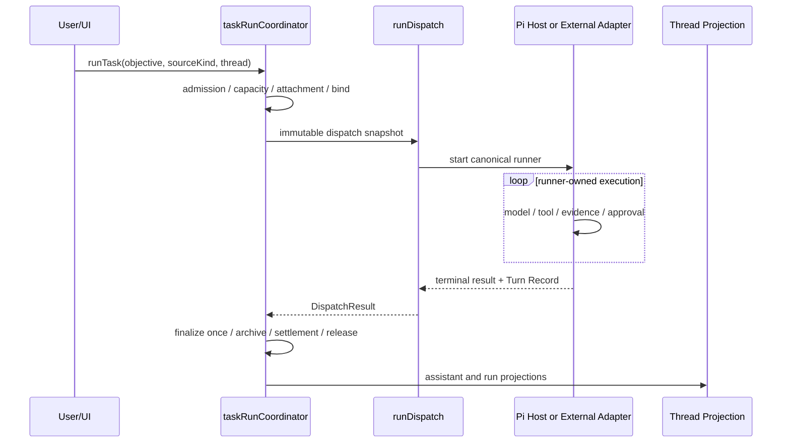

# 對話任務送出：現行 Loop × Hermes 流程

> **狀態基準**：2026-08-31。本文只描述目前 production owner；舊 browser engine／`agent/loop/` 已移除，不再作為架構錨點。
> **範圍**：互動對話入口。排程與事件入口共享 `runTask`，但 admission evidence 不同。
> **整合基準**：`docs/TASK_AGENT_WORKFLOW_INTEGRATION_PLAN_2026-07-14.md`（Phase 0–6）。

## 0. 一句話結論

所有 run 都由 `app/src/agent/taskRunCoordinator.ts` 的 `runTask` 進入。Coordinator 擁有 admission、thread 綁定、queue、finalization 與 settlement；builtin runner 交給 Electron utility process 內的 Pi Core Host 執行 tool loop，external CLI 則走明確標示為 `executionKind: 'external'` 的 adapter。UI 不得直接呼叫 `dispatchThreadTask` 或 `startExecution`。

## 1. 不變量

| 契約 | 現況 |
|------|------|
| Canonical ingress | `taskRunCoordinator.runTask` |
| Canonical finalization | Coordinator 單次 finalize／release／drain |
| Builtin tool loop owner | Pi Core Host（Electron utility process） |
| External CLI | 無 parse／DoD／iterate；CLI exit 0 不等於 DoD met |
| Conversation loop type | 未釘選時可自動選 Turn／Goal；thread pin 或 automation trigger 才 force |
| Time-based | 必須有 claimed `ScheduledJob` trigger snapshot |
| Proactive | 必須有 event matcher evidence |
| 純文字 cron/event | 只產生 automation suggestion，不直接執行 |
| Concurrency | 不同 thread 可在 `maxConcurrentRuns` 內並行；同 thread follow-up 保序 |
| Temporary chat | 不讀寫 durable memory／session recall |
| Connector secret | 只在 main-process encrypted vault；renderer 不讀 raw token |

## 2. 現行對話流程

```text
ProtocolsPage / slash executor / SubDesign follow-up
    │
    └─ taskRunCoordinator.runTask(input)
         ├─ validate objective and source kind
         ├─ automation suggestion gate
         ├─ admission / capacity / same-thread ordering
         ├─ persist + hydrate attachments
         ├─ bind thread, run registry, beforeRun
         ├─ build immutable dispatch snapshot
         └─ dispatchThreadTask(snapshot)
              ├─ builtin  → Pi Host session/run/tool loop
              └─ external → local CLI adapter
         └─ finalizeTaskRun
              ├─ Turn Record / summary / assistant bubble
              ├─ afterRun / archive / learning settlement
              └─ release capacity / drain queued work
```

### 2.1 對話入口

- Composer 與 slash command 都呼叫 `runTask`。
- 同 thread 忙碌時依 shared busy policy steer 或 queue，不建立 UI 私有 runner。
- SubDesign follow-up 同樣經 workspace owner → `runTask`，不繞過 coordinator。

### 2.2 Loop 選擇

- 未釘選的互動訊息使用 auto semantics：簡單 turn 可走 Turn-based，具可量測完成條件的任務可走 Goal-based。
- 使用者／thread 明確 pin 才覆寫 auto 結果。
- Time／Proactive 不能由 objective 文字猜測；admission 缺 trigger evidence 時 fail closed。
- Builtin 可消費 parse、DoD、iterate 與 continueGoal；external CLI capability matrix 明確將這些能力標成不可用，只有顯式 prompt contract 可要求 CLI 繼續工作。

### 2.3 Context 與 Hermes

Coordinator snapshot 與 Host runtime 組合以下資料，並保留各自 trust boundary：

- project guidance（`AGENTS.md`／`CLAUDE.md` hierarchy）
- recent conversation projection／長對話摘要
- relevant memory、failure lessons、session recall（temporary chat 跳過）
- skill／capability preload 與 progressive disclosure
- attachment／workspace evidence
- run、thread、project 與 outbound policy snapshot

這些資料是 context，不會把外部文件中的文字提升成可信指令。

### 2.4 Builtin execution

Pi Core Host 在受監督的 Electron utility process 中擁有：

- model turn 與 tool loop
- capability packs／skill resources
- approvals、HITL 與 side-effect evidence
- tool output paging／spill retrieval
- run settlement 回傳

Renderer 只透過 feature-detected bridge 取得 projection，不擁有第二套 loop。

### 2.5 External CLI execution

External adapters 共用 coordinator admission、queue、outbound policy、Turn Record 與 finalization，但不冒充 builtin loop 能力：

- `executionKind: 'external'`
- parse／DoD／iterate 為 false
- process success 只代表 adapter process 完成
- native instruction discovery、auth 與 release qualification 必須由真機 evidence 個別證明

## 3. 對話序列圖



## 4. Current owners

| 概念 | Canonical owner |
|------|-----------------|
| Run lifecycle | `app/src/agent/taskRunCoordinator.ts` |
| Dispatch snapshot／runner selection | `app/src/agent/runDispatch.ts` |
| Runner capability matrix | `app/src/agent/runners/types.ts` |
| Pi Host bridge／utility lifecycle | `app/electron/piHostEntry.ts`、`app/electron/piToolHost.ts` |
| Pi extension packs | `app/electron/piExtensionPacks/` |
| Run／thread projections | `app/src/store/agentStore.ts`、`app/src/store/threadStore.ts` |
| Context packet／prompt layers | `app/src/agent/hermes/` 與 Host resource projection |
| Outbound gate／evidence | `app/src/agent/outbound/` + main-process bridge |
| Headless development seam | `app/src/agent/headlessRun.ts`（非產品 distribution surface） |

## 5. 已完成的歷史 slices

舊版文件曾把 auto loop、replan、session recall、continueGoal、queue UX 與長對話摘要列為缺口；這些 slices 已落地，不再是 active gap：

| Slice | 狀態 |
|-------|------|
| Auto Turn／Goal + plan projection | ✅ |
| DoD missing-driven corrective iteration | ✅ |
| Skill／failure lesson／session recall | ✅ |
| continueGoal、steer digest、queue UX | ✅ |
| Per-thread bounded concurrency | ✅ |
| Pi Core Host 成為唯一 builtin tool-loop owner | ✅ |

## 6. 驗證與架構守衛

- `npm run build`：TypeScript + renderer/Electron build。
- `npm run smoke`：包含 coordinator ingress、runner contract、same-thread queue、concurrency、Pi Host、outbound 與 tracker guards。
- Drift guard 禁止 UI 直接呼叫 `dispatchThreadTask`／`startExecution`。
- ADR-0045 禁止新增 `agent/loop/` imports 或 references。
- Qualification success 必須區分 automated smoke、真 CLI discovery、平台 sandbox 與 signed release evidence。

## 7. 非目標

- 不建立第二個 renderer-owned agent loop。
- 不把 headless seam 變成產品 distribution surface（ADR-0046）。
- 不用 chat 文字繞過 Time／Proactive admission evidence。
- 不把 external CLI process success 宣稱為 Goal DoD 或 release readiness。
