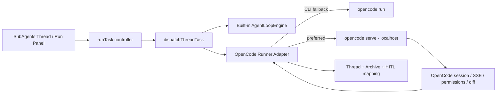

# OpenCode Repo Mapping 與修改計畫

> 研究對象：[anomalyco/opencode](https://github.com/anomalyco/opencode)（MIT，2026-07-12 查核）  
> 本文件目的：比較 OpenCode 與 SubAgents AI，定義「可互通、可漸進採用」的改造方向；**不建議 fork OpenCode 的 monorepo 或複製其 TUI**。

## 1. 結論

SubAgents AI 已有一個合理的 OpenCode 概念相容層：Build/Plan agent、`opencode.json[c]`/agents/commands 載入、permission 翻譯、MCP bridge、CLI runner 與 session recall 均已存在。它目前是「**自己的 agent runtime + 可呼叫 OpenCode CLI**」，不是 OpenCode 的 session client。

最有價值的下一步不是增加更多 OpenCode 名稱或 UI，而是把 OpenCode 的 control plane 能力接到既有 `runTask → dispatchThreadTask → runner` 管線：

1. 用受保護的本機 OpenCode Server adapter 取代一次性 `opencode run` 的孤立執行。
2. 將 OpenCode 的 agent/tool/MCP permission pattern 正確映射到本專案的 `authorizeTool` 與 HITL。
3. 將 OpenCode session、child session、diff、abort 的狀態連回現有 Thread/Archive，而不是另建第二套聊天資料庫。

## 2. OpenCode 的特色與設計重點

| 面向 | OpenCode 特點 | 對 SubAgents AI 的意義 |
|---|---|---|
| 執行核心 | CLI/TUI 其實是 server client；`opencode serve` 暴露 OpenAPI 與 SSE，可供 IDE、web 或其他程式控制。 | 可把 OpenCode 作為外部 runner，而不是把 CLI stdout 當唯一結果。 |
| Agent | 內建 primary `build`、`plan`；另有 subagent，訊息可用 `@` 指定。 | 現有 Build/Plan、delegate 已有對應，但需要真實 agent id / policy / child-session 對應。 |
| Permission | `allow` / `ask` / `deny`，可對 bash、edit、MCP tool 使用 wildcard，並可按 agent 覆寫。 | 現有 coarse policy 與 bash glob 是起點；仍缺逐一 tool/MCP pattern 的精準翻譯。 |
| Session | session 有狀態、todo、children、fork、abort、diff、revert、summary、share。 | 現有 Thread/Archive 能承載 UI，但尚未映射外部 session tree 與 diff lineage。 |
| 工具與 MCP | 內建 read/edit/search/bash/task/skill/todo/web/LSP，custom tools 與 MCP 進同一 permission 面。 | 現有 registry/capability/MCP 已成熟，適合統一 approval；不要另開繞過 `toolGuard` 的路徑。 |
| Code intelligence | Server 回報 LSP、formatter、MCP 狀態；LSP tool 支援 definition/reference/call hierarchy。 | 可補強目前 CodeGraph，尤其是 formatter/LSP health 與跳轉、影響範圍。 |
| 設定與擴充 | `opencode.json` 支援 provider、model、small model、instructions、agent、command、MCP、compaction、plugin、環境與檔案變數。 | 現有 candidate import 已避免靜默覆寫；下一步是補 source、scope、採用後的可追溯 snapshot。 |
| Provider | provider/model 與 auth 分離；可列出 provider、OAuth/auth methods、context/output limit。 | 可作為本專案 model profile 的可信外部資料源，但憑證仍必須留在 Electron vault。 |

OpenCode 官方將 Build 定位為完整開發權限、Plan 定位為唯讀分析並預設限制修改與 bash；其 permission 亦可用 wildcard 套用到 built-in、custom 和 MCP tools。[Agents](https://opencode.ai/docs/agents/)、[Tools](https://opencode.ai/docs/tools/)

它的 server 提供 project/config/provider/session/MCP/LSP/formatter 等 API；session 可取得 child sessions、todo、diff、fork、abort、revert 與 permission request 回覆。[Server API](https://opencode.ai/docs/server/)

## 3. 現況 Mapping

| OpenCode 能力 | SubAgents AI 現有錨點 | 狀態 | 差距 / 判定 |
|---|---|---|---|
| Build / Plan primary agent | `app/src/agent/opencode/agents.ts`、`ConversationSettings.tsx` | 已對應 | 模式已生效於內建 engine；外部 OpenCode CLI 尚未承接完整 agent id。 |
| Subagent | `hermes/delegate.ts`、`delegate_task`、`agentRegistry.ts` | 部分對應 | 有 isolation/budget，但不是 OpenCode child session，外部 session lineage 未保存。 |
| `opencode.json[c]`、agents、commands | `electron/opencodeBridge.ts`、`opencodeConfigStore.ts` | 已對應 | Parser 為實作子集；`plugin`、rules glob、完整 variables、完整 command schema 未完全 runtime 化。 |
| Instructions / compaction | `configCandidates.ts`、`engine.ts`、`opencode/compaction.ts` | 部分對應 | Instructions 已作 temporary apply；目前是提示 agent 再讀檔，非 OpenCode 的 resolver/檔案 glob 語意。 |
| Permission | `opencode/permissions.ts`、`toolGuard.ts`、`PermissionAskModal.tsx` | 部分對應 | 有 allow/ask/deny 與 bash pattern；但 `read/edit/glob/grep/list/task/LSP/MCP-name` 尚被粗略折疊，會遺失精細規則。 |
| MCP | `hermes/mcp.ts`、`electron/mcpBridge.ts`、`mcpDiscover.ts` | 部分對應 | 支援 HTTP/stdio、long-lived stdio session、secrets；缺 per-agent MCP enable/deny 與 server health 對應 UI。 |
| CLI runner | `localCliRunner.ts`、`runDispatch.ts` | 部分對應 | 支援一次性 `opencode run`，但無 server session、SSE、permission reply、diff/revert。 |
| Session / archive | `threadStore.ts`、`agentStore.ts`、Archive | 部分對應 | 本地 Thread/Archive 完整，但沒有 OpenCode sessionId、children、fork/diff/revert 對應。 |
| Server / IDE protocol | `opencodeBridge.ts` | 未對應 | 現有 bridge 只 detect/scan/config/one-shot run；沒有 `opencode serve` client。 |
| LSP / formatter | CodeGraph + workspace tools | 未對應 | 有 code graph，但沒有 OpenCode LSP/formatter status、operation 或 fallback contract。 |
| Provider/auth metadata | `cliDiscover.ts`、`modelProfile.ts`、vault | 部分對應 | 有本機 CLI 掃描與 profile；尚未讀取 OpenCode provider API / limit metadata。 |
| Share | `ReportModal.tsx` | 不採用 | OpenCode share 是公開連結與遠端同步；敏感程式碼風險高，應保持 disabled / explicit-only。 |

## 4. 架構決策

### 採用：Adapter，不是 fork

- 保留現有 builtin engine 作為可離線、可模擬、可自訂 capability 的預設路徑。
- OpenCode 是**可選 runner**；本專案不應將 OpenCode server 暴露到 LAN，也不應自動執行其 plugin/npm 套件。
- Thread 是 UI 與本地歷史的主體；OpenCode session 是 external execution record，以 link/snapshot 附加，不雙向覆寫。
- 所有外部 permission request 仍回到既有 `permissionAskStore`，保持 HITL、timeout、archive 審計語意一致。

### 不採用：自動 share / 無審核 plugin / 直接匯入 allow

OpenCode share 會將完整對話與 metadata 同步成持續公開連結；預設必須在本專案維持 disabled，僅經明確 user action 才可做 export。[Share](https://opencode.ai/docs/share/)

OpenCode config 可用 `{env:...}` 與 `{file:...}` 取 provider secret；SubAgents AI 僅可將它們列為候選/secret reference，不可在 renderer 展開或匯出。[Config](https://opencode.ai/docs/config/)

## 5. 修改計畫

### Phase 0 — 先收斂既有 CLI 行為（P0）

**目的：** 在尚未啟動 server 前，讓 `runner: 'opencode'` 與其他 CLI runner 有相同 lifecycle。

1. [x] 擴充 `LocalCliRunInput`：傳遞 `agentMode` → OpenCode `--agent`、`runId`、附件 `--file`、model；保留 provider-specific variant 欄位與 fallback path。
2. [x] 將目前 `opencode run` parser 改成 JSON structured event adapter：統一 `status/tool/text/error/done`，permission request 會明確停止並回報，不再只顯示無輸出 timeout。
3. [x] CLI 執行前讀取 OpenCode config candidate snapshot，記錄 config source、agent、model、permission projection、instructions hash/bytes 至 Archive。
4. [x] 補上 CLI/OpenCode adapter contract smoke；完整實機 Build/Plan、拒絕與 timeout fixture 仍待 OpenCode binary CI。

- [ ] Phase 0 完成條件：CLI 與 builtin 都有同一 runId、thread final status、queue drain、onSettled 與 Archive lineage；尚待補齊所有實機 fixture。

### Phase 1 — OpenCode Server Adapter（P0）

**新增：** `app/electron/opencodeServerBridge.ts`、`app/src/agent/opencode/serverClient.ts`。

1. [x] 偵測已在 `127.0.0.1` 運行的 server；未運行時可由使用者明確啟動 `opencode serve --hostname 127.0.0.1 --port <ephemeral>`。
2. [x] server password 僅由 main process 的 `secretsVault` 解析；禁止 `0.0.0.0`、mDNS 與 CORS 預設值。
3. [x] 實作 health、version、config/provider discovery；以 OpenAPI `/doc` 作 runtime compatibility check，而不是猜版本。
4. [x] 外部 session 建立/送 prompt/SSE event/abort 已接到 runner adapter；失敗安全降回 one-shot CLI。

- [ ] Phase 1 完成條件：server mode 可建立 session、串流 process feed、取消，且不改變 builtin runner 行為；尚待在裝有 OpenCode 的 Windows/macOS CI 做端到端實機驗證。

### Phase 2 — Session 與審計 Mapping（P1）

**修改：** `threadStore.ts`、Archive type、`runDispatch.ts`、`agentStore.ts`。

1. [x] 在 Thread 加可選 `externalRun`：`provider='opencode'`、`serverUrl`、`sessionId`、`parentSessionId`、`version`、`configFingerprint`。
2. [x] 將 `/session/:id/todo` 映射為現有 run plan；run 結束時同步 children 建立 child Thread facade，sidebar fork 會建立新的 external session lineage。
3. [x] 提供 diff preview、revert facade；真正 revert 先取 preview，再通過既有 `authorizeTool` HITL。
4. [x] Archive 增加 external session snapshot、config snapshot 與 completion reason，retry/queue 可保留外部關聯。

- [ ] Phase 2 完成條件：使用者可從 Thread 追溯外部 session、子任務與檔案 diff；執行失敗或 app 重啟不會把外部 run 誤標成功。

### Phase 3 — Permission / MCP 精準化（P0，與 Phase 1 可並行）

**修改：** `opencode/configTypes.ts`、`permissions.ts`、`agentRegistry.ts`、`toolGuard.ts`、Settings import report。

1. [x] 保存原始 OpenCode rules，新增 `OpenCodePermissionProjection`，`glob/grep/list` 不再遺失，並保留 pattern map。
2. [x] `mcp_<server>_*`、bash、task、skill、LSP/其他未支援 key 進入可審計 projection；未支援規則標示 `unsupported`，不靜默 allow。
3. [x] 父/子 delegate 採「限制只能加嚴」合併：`deny > ask > allow`；permission projection 與 builtin `toolGuard`、MCP、delegate 共用。
4. [x] MCP per-agent enable allowlist UX 已接入；agent-specific health/secret owner 顯示完成，現有 global/server enable 與 write MCP ask 保持不變。

- [ ] Phase 3 完成條件：同一個 OpenCode config rule 的預覽、builtin tool、MCP、delegate 與 external runner 都得到相同或更保守的結果。

### Phase 4 — Code Intelligence（P2）

1. [x] 新增 OpenCode LSP/formatter/MCP status reader，和現有 CodeGraph API 並列；目前不會自動開啟 experimental LSP tool。
2. [x] 新增 OpenCode experimental LSP result → 既有 KnowledgeGraph/CodeGraph shape translator，涵蓋 definition/reference/implementation/incoming/outgoing calls；未自動開啟 experimental tool。
3. [ ] formatter preview/write UI 尚未接入；write 仍須沿用既有 `authorizeTool`。

### Phase 5 — Provider 與設定互通（P2）

1. [x] 新增 provider catalog → `ModelProfile` 的 non-destructive mapper，並接入 Settings 的明確「採用 Provider candidates」流程。
2. [x] `instructions` 由 main resolver 展開受 project root 限制的 glob/file candidate，並記錄 hash 與字節數。
3. [x] 接入 `plugin` reference/permission summary：只列出 manifest reference、標示 permission unknown，不自動安裝或執行 plugin；既有 Marketplace explicit approval 流程維持不變。

## 6. 優先順序與風險

| 優先 | 項目 | 理由 | 主要風險 / 防護 |
|---|---|---|---|
| P0 | Phase 0 CLI lifecycle | 現有 OpenCode runner 最直接的可靠性缺口 | 版本 flags 漂移 → capability probe + fallback。 |
| P0 | Phase 1 server adapter | 取得 session、SSE、abort 的最大價值 | 服務暴露 → localhost-only、vault password、explicit start。 |
| P0 | Phase 3 permission/MCP | 防止 config/runner 造成權限放大 | projection 掉資料 → unsupported 顯示、deny-precedence。 |
| P1 | Phase 2 session mapping | 使 Thread/Archive 有可追溯性 | 雙資料庫漂移 → Thread 為主、external snapshot 為附屬。 |
| P2 | Phase 4 LSP/formatter | 提升 coding 品質 | experimental API → capability gate。 |
| P2 | Phase 5 provider/plugins | 降低設定重工 | secrets/plugin 供應鏈 → candidate + explicit approval。 |

## 7. 驗證矩陣

| 情境 | 必須驗證 |
|---|---|
| OpenCode CLI 不存在 | UI 有明確失敗，run/task 不卡住，builtin 不受影響。 |
| Server 健康 / 密碼錯誤 | 不送 prompt；不洩漏 password；降級到已核准的 CLI runner。 |
| Build / Plan | Plan 不能直接寫檔或執行未核准 bash；Build 仍經本專案 policy。 |
| MCP wildcard | `mcp_git_*: ask` 對所有 adapter 路徑生效。 |
| Delegate | child 的權限不比 parent 寬；depth/concurrency 仍受現有 budget 限制。 |
| Session abort / app restart | Thread/Archive final state 一致，external sessionId 不遺失。 |
| Diff / revert | 先 preview、再 approval；禁止 background/unattended 自動 revert。 |
| Config secrets / share | `{env}`/`{file}` 不出 renderer/export；share 預設 disabled。 |
| Windows / macOS | `opencode serve` 探測、停止、path、argv、附件在兩平台均通過 smoke。 |

## 8. 本次實作狀態

本次已依 Phase 0 → 1 → 2 → 3 → 4 → 5 順序落地 CLI lifecycle、localhost-only server adapter、session lineage、Thread plan/children/fork mapping、permission projection、per-agent MCP allowlist、LSP result translator、provider adoption 與 plugin permission summary。未勾選項目保留為後續工作：OpenCode 實機 CI，以及 formatter preview/write UI。

所有外部 server write path 仍經 main process、localhost validation 與既有 `authorizeTool`；share、plugin 自動安裝與 secret 展開未被啟用。

## 9. 來源

- [OpenCode GitHub repository / README](https://github.com/anomalyco/opencode)
- [OpenCode Agents and permissions](https://opencode.ai/docs/agents/)
- [OpenCode Tools and LSP](https://opencode.ai/docs/tools/)
- [OpenCode Server / OpenAPI / Sessions](https://opencode.ai/docs/server/)
- [OpenCode Config](https://opencode.ai/docs/config/)
- [OpenCode Providers](https://opencode.ai/docs/providers)
- [OpenCode MCP servers](https://opencode.ai/docs/mcp-servers)
- [OpenCode Share security model](https://opencode.ai/docs/share/)
