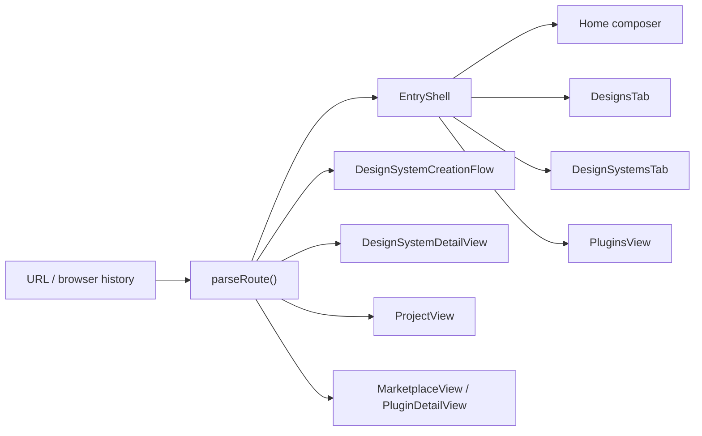
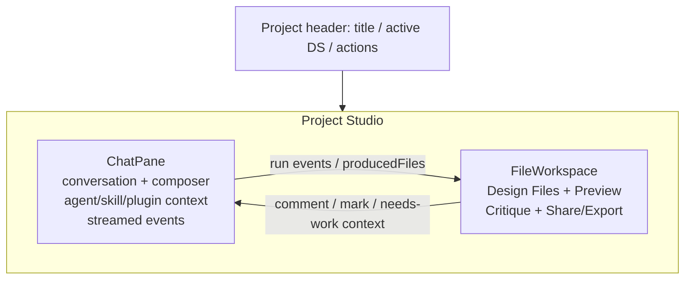
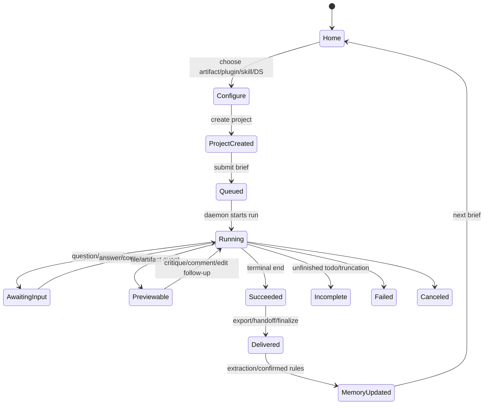
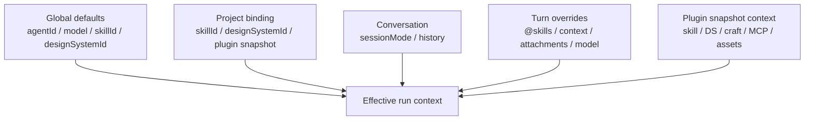
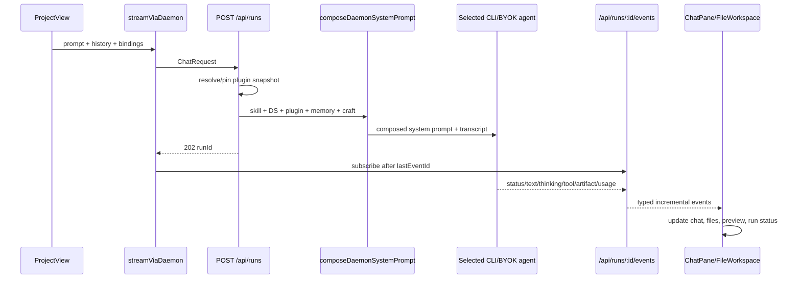
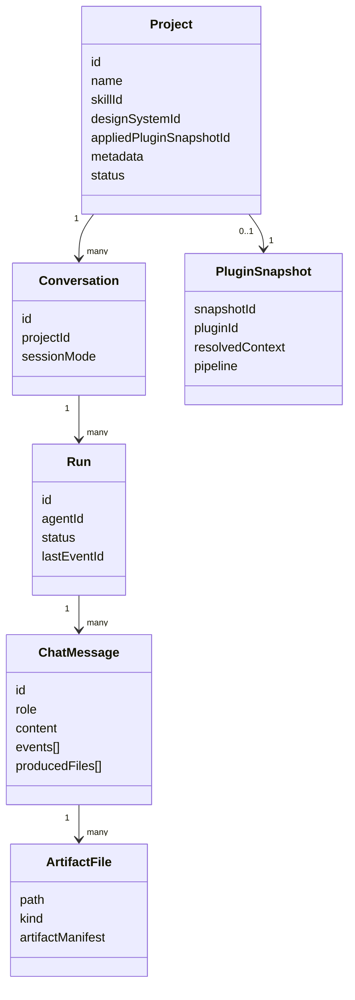
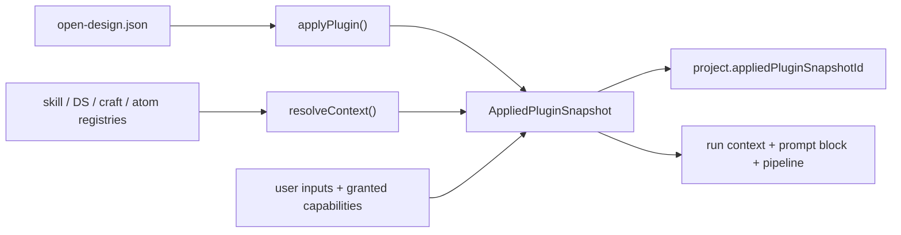
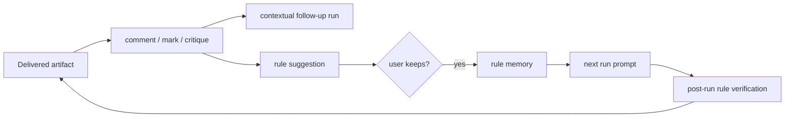
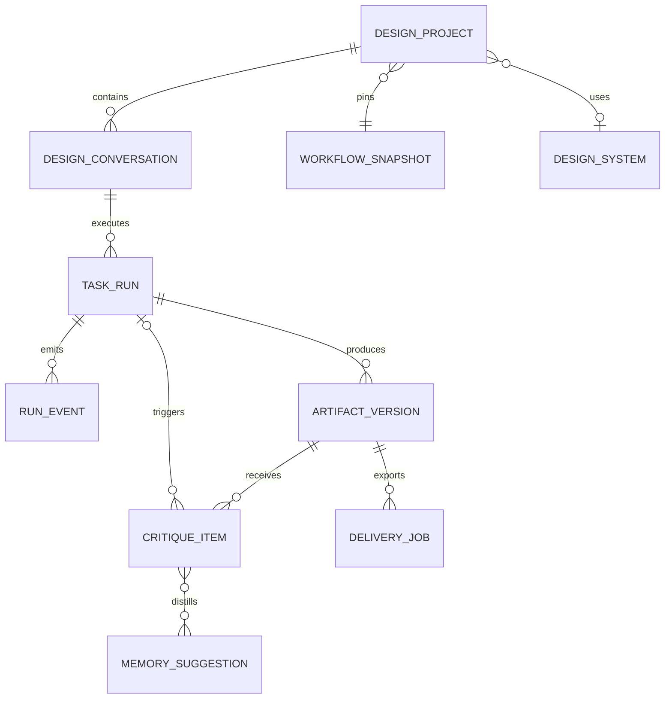

# Open Design IDE Source Research

日期：2026-07-15
研究對象：[`nexu-io/open-design`](https://github.com/nexu-io/open-design)
固定版本：[`7533db3f4342d09b27368fa5d907ebd3cdb93b75`](https://github.com/nexu-io/open-design/tree/7533db3f4342d09b27368fa5d907ebd3cdb93b75)
研究範圍：官方 repository source、README 與 repository 內第一方規格；未使用第三方文章或其他 repository。

## 0. Executive summary

Open Design IDE 的核心不是一個獨立的「Design Systems 管理頁」，而是一個由相同 Project Studio 承載的 artifact-first 工作循環：

```text
Brief → Plugin/Skill/Design System binding → Project/Conversation → Run
      → streamed events/tools/files → Preview → Critique/Edit
      → Finalize/Handoff/Export → Memory → next Brief
```

官方 README 直接把產品定義為「discover the brief, lock the direction, stream the artifact, critique, deliver」，並把 plugins、skills、design systems 定義為可組合的三個平面；完整流程則明列為 `brief → plugin → direction → design system → artifact → handoff → memory`。[README：產品定義](https://github.com/nexu-io/open-design/blob/7533db3f4342d09b27368fa5d907ebd3cdb93b75/README.md#L34-L38) [README：完整流程](https://github.com/nexu-io/open-design/blob/7533db3f4342d09b27368fa5d907ebd3cdb93b75/README.md#L368-L376)

對 AgentTeam 最重要的移植結論：

1. **把 Design System 視為 run context 與 project contract，不是孤立頁面。** 建立前它是 selector；建立後它仍顯示在 Project Studio，並與 Skill、Plugin snapshot 一起進入每次 AI run。
2. **Project、Conversation、Run、Artifact 必須分開。** Project 保存長期綁定；Conversation 保存討論分支；Run 是一次可排隊、串流、取消、恢復的執行；Artifact/File 是可預覽、評論、匯出的結果。
3. **Plugin 必須先 resolve 成不可變 snapshot，再啟動 run。** 執行時不直接依賴可能變動的 plugin catalog。
4. **UI 不是等 AI 回覆一段文字，而是投影 typed events。** text、thinking、tool use/result、status、artifact、usage 各自有資料模型與 renderer。
5. **Critique 是回到同一 artifact 的修訂迴圈。** 評論、標記、Needs work 都應攜帶檔案／元素上下文，再觸發新的 run；不是另開一個不相干的產生頁。
6. **Export、handoff、memory 是同一工作循環的後段。** Export 交付檔案；handoff 壓縮單一 conversation；memory 把確認的偏好與規則帶到下一次 prompt。

## 1. Source map：routes、pages、layouts

Open Design 使用自製的小型 History API router，而不是 React Router。理由是 route 面積小，並希望「目前開啟的檔案」直接成為可 deep-link 的 URL 單一事實來源。[`router.ts`：設計理由](https://github.com/nexu-io/open-design/blob/7533db3f4342d09b27368fa5d907ebd3cdb93b75/apps/web/src/router.ts#L1-L12)

### 1.1 Route model

| URL / route kind | 主要頁面 | 責任 |
|---|---|---|
| `/` | Home entry | brief composer、skill/plugin/design-system 起點 |
| `/projects` | Projects entry view | project library |
| `/projects/:id` | `ProjectView` | Project Studio，chat + workspace |
| `/projects/:id/conversations/:cid` | `ProjectView` | deep-link 到 conversation |
| `/projects/:id/.../files/:path` | `ProjectView` | deep-link 到 conversation 中的 file |
| `/design-systems` | `DesignSystemsTab` | catalog/default selector |
| `/design-systems/create` | `DesignSystemCreationFlow` | 收集來源並建立 DS project |
| `/design-systems/:id` | `DesignSystemDetailView` | system/files review workspace |
| `/plugins`、`/marketplace` | Plugins/Marketplace | plugin discovery/install |
| `/automations` | Tasks/Automation | repeat workflow entry |
| `/integrations` | Integration entry | MCP/connectors |

Route union、URL parser 與 path builder 均集中於同一檔案；project route 同時容納 `projectId`、`conversationId`、`fileName`。[`Route` union](https://github.com/nexu-io/open-design/blob/7533db3f4342d09b27368fa5d907ebd3cdb93b75/apps/web/src/router.ts#L13-L53) [`parseRoute`](https://github.com/nexu-io/open-design/blob/7533db3f4342d09b27368fa5d907ebd3cdb93b75/apps/web/src/router.ts#L55-L128) [`buildPath`](https://github.com/nexu-io/open-design/blob/7533db3f4342d09b27368fa5d907ebd3cdb93b75/apps/web/src/router.ts#L131-L161)



`App` 是 route composition root：依 route 直接組裝 marketplace、DS create/detail、`ProjectView` 或 `EntryView`，並把 catalogs、config 與 action callbacks 注入。[`App` route composition](https://github.com/nexu-io/open-design/blob/7533db3f4342d09b27368fa5d907ebd3cdb93b75/apps/web/src/App.tsx#L2340-L2494)

### 1.2 Entry layout

Entry layout 是左側 `EntryNavRail` 加右側可捲動 main；New Project 是 rail 的一級 action。Projects、Tasks、Plugins、Design Systems 是同一 entry shell 的 views，不是各自重複一套 app chrome。[`EntryShell` layout](https://github.com/nexu-io/open-design/blob/7533db3f4342d09b27368fa5d907ebd3cdb93b75/apps/web/src/components/EntryShell.tsx#L962-L980) [`EntryShell` view composition](https://github.com/nexu-io/open-design/blob/7533db3f4342d09b27368fa5d907ebd3cdb93b75/apps/web/src/components/EntryShell.tsx#L1133-L1206)

README 對 Home 的描述也一致：在一個入口選 skill、design system、輸入 brief。[README Product tour](https://github.com/nexu-io/open-design/blob/7533db3f4342d09b27368fa5d907ebd3cdb93b75/README.md#L43-L53)

### 1.3 Project Studio layout

Project Studio 是可調整寬度的雙欄 layout：左欄 `ChatPane`，右欄 `FileWorkspace`。ChatPane 同時擁有 conversation、session mode、agent actions、plugin/skill/design-system context；FileWorkspace 擁有 files、live artifacts、preview、review、share/export。Project header 內直接放 Design System picker，因此 DS 並未與 project 操作流程切開。[`ProjectView` split shell](https://github.com/nexu-io/open-design/blob/7533db3f4342d09b27368fa5d907ebd3cdb93b75/apps/web/src/components/ProjectView.tsx#L8638-L8665) [`ChatPane` context/actions](https://github.com/nexu-io/open-design/blob/7533db3f4342d09b27368fa5d907ebd3cdb93b75/apps/web/src/components/ProjectView.tsx#L8666-L8835) [`FileWorkspace` mount](https://github.com/nexu-io/open-design/blob/7533db3f4342d09b27368fa5d907ebd3cdb93b75/apps/web/src/components/ProjectView.tsx#L8842-L8879)



## 2. Creation workflow 與分散式 state machine

### 2.1 建立 Project

`NewProjectPanel` 的 create payload 只保存核心 binding：`name`、`skillId`、`designSystemId`、`metadata`，另可帶 working-directory token。[`CreateInput`](https://github.com/nexu-io/open-design/blob/7533db3f4342d09b27368fa5d907ebd3cdb93b75/apps/web/src/components/NewProjectPanel.tsx#L124-L150)

建立時先由 tab/fidelity/platform/template/media 選擇組出 `ProjectMetadata`，第一個 DS 是 primary，其餘多選 DS 放入 inspirations；再送往 `App.handleCreateProject`。[`NewProjectPanel.handleCreate`](https://github.com/nexu-io/open-design/blob/7533db3f4342d09b27368fa5d907ebd3cdb93b75/apps/web/src/components/NewProjectPanel.tsx#L708-L776) [`DesignSystemPicker` 多選語意](https://github.com/nexu-io/open-design/blob/7533db3f4342d09b27368fa5d907ebd3cdb93b75/apps/web/src/components/NewProjectPanel.tsx#L2111-L2186)

`App.handleCreateProject` 呼叫 project API，傳入 skill、DS、pending prompt、metadata、conversation mode 與 plugin snapshot/inputs；project 建立後才處理 working directory 與附件，避免附件先寫入暫存 workspace 後因 root 切換而消失。[`App.handleCreateProject`](https://github.com/nexu-io/open-design/blob/7533db3f4342d09b27368fa5d907ebd3cdb93b75/apps/web/src/App.tsx#L1472-L1503) [working directory / attachment ordering](https://github.com/nexu-io/open-design/blob/7533db3f4342d09b27368fa5d907ebd3cdb93b75/apps/web/src/App.tsx#L1544-L1591)

### 2.2 建立 Design System

DS 建立 flow 的顯式 UI step 只有 `setup | confirm`，但其資料狀態包含 URL、Figma URL/files、本機 code folders/files、assets、company、notes、手寫 `DESIGN.md` 等來源。[`SetupStep` / `SetupState`](https://github.com/nexu-io/open-design/blob/7533db3f4342d09b27368fa5d907ebd3cdb93b75/apps/web/src/components/DesignSystemFlow.tsx#L196-L215) [`DesignSystemCreationFlow` state](https://github.com/nexu-io/open-design/blob/7533db3f4342d09b27368fa5d907ebd3cdb93b75/apps/web/src/components/DesignSystemFlow.tsx#L327-L380)

產生不是在 wizard 中等待完整結果：`generate()` 先 snapshot source counts，呼叫 two-phase brand extraction；daemon 先建立 backing Project + Conversation，之後程式化 extraction 在背景註冊可用 DS，UI 隨即導航到 Project Studio 繼續觀看 live generation。[`generate()` source snapshot](https://github.com/nexu-io/open-design/blob/7533db3f4342d09b27368fa5d907ebd3cdb93b75/apps/web/src/components/DesignSystemFlow.tsx#L842-L909) [two-phase extraction and project handoff](https://github.com/nexu-io/open-design/blob/7533db3f4342d09b27368fa5d907ebd3cdb93b75/apps/web/src/components/DesignSystemFlow.tsx#L910-L985)

### 2.3 實際狀態機不是單一 enum

Source 沒有一個涵蓋全 IDE 的中央 state-machine reducer。流程由下列狀態共同構成：

- Route：Home / DS create / DS detail / Project / Marketplace。
- Setup state：`setup → generating`，失敗回 setup，成功進 Project route。
- Project display status：`not_started / queued / running / awaiting_input / succeeded / incomplete / failed / canceled`。[`ProjectDisplayStatus`](https://github.com/nexu-io/open-design/blob/7533db3f4342d09b27368fa5d907ebd3cdb93b75/packages/contracts/src/api/projects.ts#L32-L51)
- Run status：`queued / running / succeeded / failed / canceled`，並把 result delivery 狀態另行分離。[`ChatRunStatus`](https://github.com/nexu-io/open-design/blob/7533db3f4342d09b27368fa5d907ebd3cdb93b75/packages/contracts/src/api/chat.ts#L302-L313)
- Conversation session mode：`design / chat / plan`。[`ChatSessionMode`](https://github.com/nexu-io/open-design/blob/7533db3f4342d09b27368fa5d907ebd3cdb93b75/packages/contracts/src/api/chat.ts#L30-L40)
- Artifact/file state：由 filesystem、manifest、live-artifact events 與 preview tabs 投影。



**移植判斷：** AgentTeam 不應把這套流程壓成 `currentStep: 1..7`。應保存多個正交狀態，並用 selector 導出 UI phase，否則 queued、streaming、artifact-ready、delivery-failed、resumable 等狀態會互相覆蓋。

## 3. Settings 與 selectors

### 3.1 設定分層

第一方 contract 的 `AppConfigPrefs` 保存 agent、per-agent model/reasoning、CLI env intent、default skill、default DS、disabled catalogs、custom instructions、project locations 等偏好。[`AppConfigPrefs`](https://github.com/nexu-io/open-design/blob/7533db3f4342d09b27368fa5d907ebd3cdb93b75/packages/contracts/src/api/app-config.ts#L1-L63)

Renderer `DEFAULT_CONFIG` 同時包含 execution mode、API protocol/key/base URL/model、agent/skill/DS、theme、media providers、connectors 與 UI preferences。[`DEFAULT_CONFIG`](https://github.com/nexu-io/open-design/blob/7533db3f4342d09b27368fa5d907ebd3cdb93b75/apps/web/src/state/config.ts#L61-L89)

持久化採混合策略：renderer-local 欄位進 localStorage；daemon-owned 欄位會從 local payload 移除，再由 daemon config merge 回來。Agent model map 等 object 做顯式 merge，disabled arrays 由 daemon 覆蓋。[`loadConfig`](https://github.com/nexu-io/open-design/blob/7533db3f4342d09b27368fa5d907ebd3cdb93b75/apps/web/src/state/config.ts#L561-L650) [`saveConfig` / `mergeDaemonConfig`](https://github.com/nexu-io/open-design/blob/7533db3f4342d09b27368fa5d907ebd3cdb93b75/apps/web/src/state/config.ts#L869-L915)

### 3.2 Selector 的層級



Design System 有三個不同 selector：global default、project primary、turn/plugin context。Daemon 的優先序解析會考慮 request DS、plugin DS、project DS、app default；project 明確為 `null` 時不應偷偷套回 global default。[`resolveEffectiveDesignSystemSelection` call](https://github.com/nexu-io/open-design/blob/7533db3f4342d09b27368fa5d907ebd3cdb93b75/apps/daemon/src/server.ts#L3502-L3539)

Agent selector 不是只有 id；`AgentInfo` 也包含 availability、auth、diagnostics、model options、reasoning options 與 MCP injection 能力，因此 UI 應顯示「能否執行與如何修復」，不能只顯示 agent 名稱。[`AgentInfo`](https://github.com/nexu-io/open-design/blob/7533db3f4342d09b27368fa5d907ebd3cdb93b75/packages/contracts/src/api/registry.ts#L97-L140)

Skill selector 的 mode 是 artifact surface 的分類，而不只是 prompt 標籤；還包含 `designSystemRequired` 與 defaults。[`SkillSummary`](https://github.com/nexu-io/open-design/blob/7533db3f4342d09b27368fa5d907ebd3cdb93b75/packages/contracts/src/api/registry.ts#L156-L190)

## 4. AI agent invocation 與 streaming

### 4.1 Web → run request

`ProjectView.handleSend` 先鎖定 active conversation 與 session mode，處理 retry target、attachments/comments、busy queue、balance gate，再建立 user/assistant optimistic messages。Agent/model 是從 config 與 agent registry 解析，而不是寫死在 page component。[`handleSend` guards/queue](https://github.com/nexu-io/open-design/blob/7533db3f4342d09b27368fa5d907ebd3cdb93b75/apps/web/src/components/ProjectView.tsx#L4921-L4975) [`handleSend` optimistic messages and model selection](https://github.com/nexu-io/open-design/blob/7533db3f4342d09b27368fa5d907ebd3cdb93b75/apps/web/src/components/ProjectView.tsx#L5091-L5154)

真正 run request 同時傳入：agent、history、project/conversation/message ids、primary + ad-hoc skills、run context、DS、attachments、comment context、session mode、plugin snapshot、research、media execution、model/reasoning 與 analytics hints。[`streamViaDaemon` invocation](https://github.com/nexu-io/open-design/blob/7533db3f4342d09b27368fa5d907ebd3cdb93b75/apps/web/src/components/ProjectView.tsx#L5929-L6045)

`ChatRequest` contract 明確區分持久化 project skill 與只對本 turn 生效的 `skillIds[]`，並保留 plugin snapshot、tool bundle、BYOK、research 與 media policy 欄位。[`ChatRequest`](https://github.com/nexu-io/open-design/blob/7533db3f4342d09b27368fa5d907ebd3cdb93b75/packages/contracts/src/api/chat.ts#L58-L125)

### 4.2 Run creation → prompt binding → agent execution



Web 先 `POST /api/runs` 取得 `runId`，再讀 `/api/runs/:id/events`；request body 會把所有 run-scoped context 正規化成 `ChatRequest`。[`streamViaDaemon`](https://github.com/nexu-io/open-design/blob/7533db3f4342d09b27368fa5d907ebd3cdb93b75/apps/web/src/providers/daemon.ts#L628-L743)

Daemon 的 `/api/runs` route 先解析 tool bundle 與 plugin snapshot，必要時沿用 project pin 或 scenario fallback；再決定 agent、conversation/session mode、建立 run，回 `202` 後才非同步 start。[`POST /api/runs`](https://github.com/nexu-io/open-design/blob/7533db3f4342d09b27368fa5d907ebd3cdb93b75/apps/daemon/src/routes/runs.ts#L504-L579) [run creation/start](https://github.com/nexu-io/open-design/blob/7533db3f4342d09b27368fa5d907ebd3cdb93b75/apps/daemon/src/routes/runs.ts#L580-L729)

System prompt composition 會解析 primary/ad-hoc skills、effective DS、plugin-local skill、craft、memory、critique 與 active pipeline stages；最後一次性送入 `composeSystemPrompt`。[skill/DS resolution](https://github.com/nexu-io/open-design/blob/7533db3f4342d09b27368fa5d907ebd3cdb93b75/apps/daemon/src/server.ts#L3476-L3658) [plugin-local skill override](https://github.com/nexu-io/open-design/blob/7533db3f4342d09b27368fa5d907ebd3cdb93b75/apps/daemon/src/server.ts#L3666-L3705) [final prompt composition](https://github.com/nexu-io/open-design/blob/7533db3f4342d09b27368fa5d907ebd3cdb93b75/apps/daemon/src/server.ts#L4008-L4085)

### 4.3 Streaming protocol

SSE consumer 支援 `after=<lastEventId>` 重連。`stdout` 轉 text delta；`agent` frame 可轉 tool-input delta 或 typed agent event；`start` 轉 running；`error` 暫存等待 terminal 判定；`end` 才決定最終 status、resumable 與 artifact count。[SSE reconnect/read loop](https://github.com/nexu-io/open-design/blob/7533db3f4342d09b27368fa5d907ebd3cdb93b75/apps/web/src/providers/daemon.ts#L1082-L1142) [SSE event dispatch](https://github.com/nexu-io/open-design/blob/7533db3f4342d09b27368fa5d907ebd3cdb93b75/apps/web/src/providers/daemon.ts#L1144-L1217)

**移植判斷：** AgentTeam 應讓 renderer 只 consume run/event contracts；CLI spawn、secrets、filesystem diff、tool permission 與 retry/resume 應留在 Electron main/agent coordinator，避免 page 直接呼叫 runner。

## 5. Events、actions、object models

### 5.1 核心 aggregate



`Project` 持久保存 `skillId`、`designSystemId`、status、pending prompt、metadata 與 pinned plugin snapshot。[`Project`](https://github.com/nexu-io/open-design/blob/7533db3f4342d09b27368fa5d907ebd3cdb93b75/packages/contracts/src/api/projects.ts#L216-L233)

`ProjectMetadata` 承載 artifact kind、intent、fidelity、platform、template/media settings，並包含 DS review decision/task，因此不是任意 `Record<string, unknown>`。[`ProjectMetadata`](https://github.com/nexu-io/open-design/blob/7533db3f4342d09b27368fa5d907ebd3cdb93b75/packages/contracts/src/api/projects.ts#L78-L125)

`DesignSystemSummary` 是 catalog/project reference；detail 才多 `body` 與 package info，包括 tokens、components、usage、import metadata。[`DesignSystemSummary` / detail](https://github.com/nexu-io/open-design/blob/7533db3f4342d09b27368fa5d907ebd3cdb93b75/packages/contracts/src/api/registry.ts#L277-L329)

### 5.2 Event projection

Persisted agent events 是 discriminated union：status、text、title、thinking、live artifact lifecycle、tool use/result、diagnostic、plugin candidate、usage、raw。`ChatMessage` 再把 run status、resume cursor、context、attachments、produced files 與 feedback 綁在一起。[`PersistedAgentEvent`](https://github.com/nexu-io/open-design/blob/7533db3f4342d09b27368fa5d907ebd3cdb93b75/packages/contracts/src/api/chat.ts#L568-L640) [`ChatMessage`](https://github.com/nexu-io/open-design/blob/7533db3f4342d09b27368fa5d907ebd3cdb93b75/packages/contracts/src/api/chat.ts#L642-L670)

建議 AgentTeam action taxonomy：

- Intent actions：`brief.submitted`、`binding.changed`、`critique.submitted`。
- Lifecycle actions：`run.queued/running/succeeded/failed/canceled`。
- Stream actions：`message.delta`、`thinking.delta`、`tool.started/completed`。
- Artifact actions：`artifact.created/updated/deleted`、`file.changed`。
- Delivery actions：`export.started/completed`、`handoff.created`。
- Memory actions：`memory.suggested/kept/verified`。

事件必須有 `runId`，artifact/file 事件另帶 `projectId`；否則 concurrent runs 時無法正確投影。

## 6. Tools、plugins、skills、Design System binding

### 6.1 Plugin manifest 是 declarative workflow contract

Plugin manifest 的 `od` 區塊可宣告 kind、task kind、mode/platform/scenario、preview/use case、context、pipeline、GenUI、connectors、inputs、capabilities。Context 又可引用 skills、design system、craft、assets、Claude plugins、MCP 與 atoms。[`PluginManifestSchema`](https://github.com/nexu-io/open-design/blob/7533db3f4342d09b27368fa5d907ebd3cdb93b75/packages/contracts/src/plugins/manifest.ts#L145-L217)



Pure resolver 把 manifest refs 對到 registry objects，輸出 typed context chips、warnings 與 digest refs；若 plugin 要 primary DS 但沒明確 ref，可使用 active project DS。[`resolveContext`](https://github.com/nexu-io/open-design/blob/7533db3f4342d09b27368fa5d907ebd3cdb93b75/packages/plugin-runtime/src/resolve.ts#L8-L30) [skill/DS resolution](https://github.com/nexu-io/open-design/blob/7533db3f4342d09b27368fa5d907ebd3cdb93b75/packages/plugin-runtime/src/resolve.ts#L61-L100)

### 6.2 Snapshot 是唯一執行邊界

官方 source 明確宣告 `AppliedPluginSnapshot` 是 plugin 與 run 之間唯一 contract。Resolver 支援：重用指定 snapshot、由 plugin + inputs 產生 snapshot、或無 plugin 時走 legacy path；同時在 snapshot 階段執行 capability gate。[`resolve-snapshot.ts` invariant](https://github.com/nexu-io/open-design/blob/7533db3f4342d09b27368fa5d907ebd3cdb93b75/apps/daemon/src/plugins/resolve-snapshot.ts#L1-L21)

Project 已 pin snapshot 時，新的 `/api/runs` 不必重新傳 plugin id，resolver 會沿用 project snapshot，避免 catalog 更新後同一 project 的 workflow 漂移。[pinned snapshot reuse](https://github.com/nexu-io/open-design/blob/7533db3f4342d09b27368fa5d907ebd3cdb93b75/apps/daemon/src/plugins/resolve-snapshot.ts#L98-L152)

**移植判斷：** AgentTeam 現有 capability/tool system 可成為執行層，但 SubDesign 應增加 immutable `AppliedWorkflowSnapshot`：

```ts
interface AppliedWorkflowSnapshot {
  id: string;
  pluginId: string | null;
  skillIds: string[];
  designSystemId: string | null;
  capabilityIds: string[];
  toolNames: string[];
  inputValues: Record<string, unknown>;
  pipeline?: { stages: Array<{ id: string; atomIds: string[] }> };
  digest: string;
  createdAt: number;
}
```

Snapshot 必須由 coordinator 建立、驗證與持久化；UI 只選擇與展示，不直接組 system prompt。

## 7. Preview、artifact、critique、export、memory

### 7.1 Artifact 與 Preview

Renderer registry 依 artifact manifest 選 HTML/deck、React component、Markdown、SVG 等 renderer；`FileViewer` 再分派到對應 viewer，並把 streaming 與 comment callbacks 傳入 HTML viewer。[renderer selection](https://github.com/nexu-io/open-design/blob/7533db3f4342d09b27368fa5d907ebd3cdb93b75/apps/web/src/components/FileViewer.tsx#L1263-L1334)

Preview iframe 使用 sandbox；live artifact 使用 URL-loaded iframe，普通 artifact 使用 `srcDoc` transport。Sandbox 不開 `allow-same-origin`，因此 snapshot/export bridge 必須在 iframe 內執行再用 `postMessage` 傳回。[live artifact iframe](https://github.com/nexu-io/open-design/blob/7533db3f4342d09b27368fa5d907ebd3cdb93b75/apps/web/src/components/FileViewer.tsx#L1818-L1837) [`srcdoc` export security model](https://github.com/nexu-io/open-design/blob/7533db3f4342d09b27368fa5d907ebd3cdb93b75/apps/web/src/runtime/srcdoc.ts#L622-L627)

### 7.2 Critique

有兩層 critique：

1. **Human review loop：** Design System section 可標記 Looks good 或 Needs work；Needs work 收集 feedback + files，呼叫 agent task，再把 decision 與 task 狀態存回 project metadata。[review actions](https://github.com/nexu-io/open-design/blob/7533db3f4342d09b27368fa5d907ebd3cdb93b75/apps/web/src/components/FileWorkspace.tsx#L4546-L4585) [review reopen semantics](https://github.com/nexu-io/open-design/blob/7533db3f4342d09b27368fa5d907ebd3cdb93b75/apps/web/src/components/FileWorkspace.tsx#L4587-L4616)
2. **Critique Theater：** 可選 designer、critic、brand、a11y、copy panelists，設定 rounds、threshold、weights、timeouts 與 fallback；round decision 是 continue/ship，最後產生 typed ship/degraded/interrupted/failed events。[Critique config](https://github.com/nexu-io/open-design/blob/7533db3f4342d09b27368fa5d907ebd3cdb93b75/packages/contracts/src/critique.ts#L17-L72) [panel events](https://github.com/nexu-io/open-design/blob/7533db3f4342d09b27368fa5d907ebd3cdb93b75/packages/contracts/src/critique.ts#L102-L124)

### 7.3 Finalize、handoff、export

- **Finalize**：根據 artifact + conversation synthesis 原子寫入 `DESIGN.md`，回傳 path、bytes、token usage、artifact ref 與 DS id。[Finalize contract](https://github.com/nexu-io/open-design/blob/7533db3f4342d09b27368fa5d907ebd3cdb93b75/packages/contracts/src/api/finalize.ts#L30-L80)
- **Handoff**：只壓縮指定 conversation，不混入 project 內其他 conversation；輸出下一個 agent conversation 可使用的第一則 Markdown prompt。[Handoff contract](https://github.com/nexu-io/open-design/blob/7533db3f4342d09b27368fa5d907ebd3cdb93b75/packages/contracts/src/api/handoff.ts#L1-L53)
- **Export**：HTML 可直接下載或由 daemon inline assets；PDF 優先 desktop export、失敗退回 browser/programmatic；PPTX/PDF-image 由 off-screen renderer 產生 bytes。[HTML export](https://github.com/nexu-io/open-design/blob/7533db3f4342d09b27368fa5d907ebd3cdb93b75/apps/web/src/runtime/exports.ts#L1-L100) [PDF fallback](https://github.com/nexu-io/open-design/blob/7533db3f4342d09b27368fa5d907ebd3cdb93b75/apps/web/src/runtime/exports.ts#L758-L786) [PPTX export](https://github.com/nexu-io/open-design/blob/7533db3f4342d09b27368fa5d907ebd3cdb93b75/apps/web/src/runtime/exports.ts#L899-L964)

### 7.4 Memory

Memory 是 filesystem Markdown store：每個 fact 一個 `.md`，`MEMORY.md` 是 active index；types 包含 profile、user、feedback、project、reference、rule。[memory store/types](https://github.com/nexu-io/open-design/blob/7533db3f4342d09b27368fa5d907ebd3cdb93b75/packages/contracts/src/api/memory.ts#L1-L41)

Memory hooks 分為 prompt injection、chat extraction、profile、pre-run rewrite、post-run verify。Extraction 可在每 turn 後背景進行，memory system prompt 則供 daemon/BYOK 在下一 turn 注入。[memory hooks/list](https://github.com/nexu-io/open-design/blob/7533db3f4342d09b27368fa5d907ebd3cdb93b75/packages/contracts/src/api/memory.ts#L81-L111) [extraction/system prompt/SSE](https://github.com/nexu-io/open-design/blob/7533db3f4342d09b27368fa5d907ebd3cdb93b75/packages/contracts/src/api/memory.ts#L259-L329)

Artifact annotations 可以 distill 成 rule proposals，必須經 Keep gate；若 verify 開啟，daemon 會在產生 artifact 的 turn 後程式化檢查 active rules 是否都有 scorecard coverage，而不是相信模型自行宣稱完成。[annotation-to-rule](https://github.com/nexu-io/open-design/blob/7533db3f4342d09b27368fa5d907ebd3cdb93b75/packages/contracts/src/api/memory.ts#L534-L577) [post-run enforcement](https://github.com/nexu-io/open-design/blob/7533db3f4342d09b27368fa5d907ebd3cdb93b75/packages/contracts/src/api/memory.ts#L579-L610)



## 8. AgentTeam target architecture

### 8.1 建議 domain boundaries

| Module | 擁有的事實 | 不應擁有 |
|---|---|---|
| `subdesign/projects` | project、conversation、workspace tabs、active bindings | agent spawn、secrets |
| `subdesign/workflows` | plugin/skill/DS selection、immutable snapshot、pipeline stages | React page state |
| `taskRunCoordinator` | capacity、queue、run lifecycle、runner dispatch、settlement | UI layout |
| `subdesign/events` | typed run/artifact/tool/critique events與投影 | raw IPC implementation |
| `subdesign/artifacts` | manifest、file versions、renderer selection | chat history |
| `subdesign/critique` | comments/marks/review gates/panel runs | export bytes |
| `subdesign/delivery` | finalize/handoff/export jobs | prompt selectors |
| `hermes/memory` | suggestions、Keep gate、prompt injection、verification | project UI navigation |

### 8.2 建議資料關聯



### 8.3 UI workflow

1. **Home**：單一 brief composer；Artifact/Plugin/Skill/DS 都是 context selectors。
2. **Create gate**：顯示將被 pin 的 effective context，確認後建立 project + conversation + workflow snapshot。
3. **Studio**：左側 Agent timeline/composer，右側 Files/Preview/Questions/Review；header 永遠顯示 active DS。
4. **Streaming**：run events 驅動 status/tool/todo/message；file events 驅動 preview，不等整個 run 結束。
5. **Critique**：comment/mark/needs-work 在同一 artifact version 上建立 contextual follow-up。
6. **Delivery**：Finalize、Handoff、Export 是可追蹤 job，結果與失敗原因可重試。
7. **Memory**：完成後提出可保留的偏好/規則，必須由使用者確認才成為未來預設。

## 9. 分階段實作計畫

以下 checklist 是研究導出的 implementation plan；本文件只做研究，不代表項目已實作。

### Phase 0 — Contract lock

- [ ] 定義 `DesignProject`、`DesignConversation`、`AppliedWorkflowSnapshot`、`ArtifactVersion`、`RunEvent`。
- [ ] 定義 route contract：project、conversation、file deep links。
- [ ] 定義 run/event persistence 與 reload/reconnect invariants。
- [ ] 為「Project 明確選 None DS 不回退 global default」加 smoke test。
- [ ] 為「plugin snapshot pinned 後 catalog 更新不改變既有 project」加 regression test。

驗收：純 domain tests 可證明 object ownership、selector precedence、serialization 與 migration。

### Phase 1 — Entry creation workflow

- [ ] 將 SubDesign 首頁收斂成 brief composer + artifact/plugin/skill/DS selectors。
- [ ] selector 顯示 availability、required inputs、capabilities 與 validation errors。
- [ ] 建立 project 時原子建立 default conversation 與 workflow snapshot。
- [ ] 保留 project default 與 per-turn ad-hoc skill 的差異。
- [ ] Design System create 成功後直接導航至同一 Project Studio，不停留在孤立結果頁。

驗收：從 Home 可建立 project；reload 後 bindings、pending prompt、conversation 不遺失。

### Phase 2 — Studio shell and deep links

- [ ] 建立固定的 ChatPane + FileWorkspace split shell。
- [ ] Project header 顯示/切換 active DS，切換會 patch project 並影響下一 run。
- [ ] URL 保存 project/conversation/file；back/forward 不丟 workspace state。
- [ ] conversations、workspace tabs、active file 分開持久化。
- [ ] Design System detail 共用 Studio shell 的 system/files review 模式。

驗收：同一 project 內切 conversation/file、reload、返回都落在相同位置。

### Phase 3 — Run invocation and streaming projection

- [ ] UI 全部經 `taskRunCoordinator.runTask`，不得直接呼叫 runner。
- [ ] coordinator 接收 workflow snapshot、conversation、attachments、session mode。
- [ ] run event 增加 stable `eventId`，支援 `afterEventId` reconnect。
- [ ] 實作 text/thinking/status/tool/todo/artifact/usage event renderers。
- [ ] busy conversation 採 queue/dedupe，不允許重複啟動同一 client request。
- [ ] run 結束與 result delivery 分開建模。

驗收：中斷 renderer/reload 後能 reattach；事件不重複；concurrent runs 不互相污染。

### Phase 4 — Artifact workspace and preview

- [ ] 建立 manifest-driven renderer registry。
- [ ] HTML/deck preview 使用 sandboxed iframe；Electron/browser 均 feature-detect。
- [ ] streaming file update 只更新對應 artifact/version。
- [ ] 加入 desktop/tablet/mobile viewport、code/preview tabs、zoom。
- [ ] preview bridge 僅允許 allowlisted postMessage actions。

驗收：HTML/deck/Markdown/image 至少四種 artifact 可正確選 renderer；惡意 preview 無法取得 host origin/filesystem。

### Phase 5 — Critique and revision loop

- [ ] 建立 comment、mark、Looks good、Needs work contracts。
- [ ] feedback 必須帶 artifactVersionId、file path、selection/element context。
- [ ] Needs work 建立新的 contextual run，而非覆蓋原 artifact。
- [ ] regenerated artifact 標記「changed after feedback」並重新開啟 review gate。
- [ ] 視需要加入多角色 critique；預設關閉並受既有 sub-agent toggle 控制。

驗收：可從 preview 評論 → run → 新 version → re-review；舊 version/feedback 可追溯。

### Phase 6 — Finalize, handoff, export

- [ ] Finalize 從指定 conversation + artifact 產生/更新 `DESIGN.md`。
- [ ] Handoff 只摘要單一 conversation，禁止混合其他分支。
- [ ] HTML/ZIP/PDF/PPTX/export 建立 typed delivery jobs。
- [ ] 每個 export 都記錄 source artifact version、格式、狀態、錯誤與重試。
- [ ] Electron export failure 提供安全 fallback，且不把 semantic failure 偽裝成成功。

驗收：交付物能對回 source version；取消/失敗/重試狀態正確。

### Phase 7 — Memory and defaults

- [ ] 將成功 artifact、確認的品牌、annotations 轉為 memory suggestions。
- [ ] suggestions 經 Keep/Reject gate，不自動永久化。
- [ ] 分開 profile、feedback、project、reference、rule 類型。
- [ ] next run prompt 只注入 active index 中的 memory。
- [ ] artifact-producing run 執行 deterministic rule coverage verification。

驗收：拒絕的 suggestion 不影響後續；active rule 缺漏會明確顯示 missing/fail。

### Phase 8 — Product hardening

- [ ] 對 create → stream → critique → export → memory 建立 Electron E2E。
- [ ] 為 offline/agent missing/auth missing/stream drop/reload/cancel 建立回歸測試。
- [ ] 加入 accessibility keyboard/focus/aria 驗證。
- [ ] 建立 run/artifact/delivery observability，但不記錄 secrets 或完整敏感 prompt。
- [ ] 完成 migration，移除舊的孤立 Design System landing 與重複 route/state。

驗收：build、lint、smoke、Electron E2E 通過；無已知重複 run、stale preview、錯誤 DS fallback。

## 10. Implementation rules for AgentTeam

1. **Binding precedence 要有純函式與測試。** Request override → plugin snapshot → project binding → global default；project explicit `null` 是有意義的選擇。
2. **Sub-agent toggle 必須在 orchestration boundary gate。** UI 顯示多角色 critique 不代表可執行；預設關閉時只走單 agent，且不能偷偷 spawn leaf agent。
3. **所有 run 都要 clientRequestId + runId。** clientRequestId 做 ingress dedupe，runId 做後續 event/object ownership。
4. **Artifact 要 versioned。** Critique 與 export 指向 immutable version，active file 只是 pointer。
5. **Plugin/context 要 snapshot。** 執行中不得重新讀 UI 當下 selection 拼 prompt。
6. **Tool events 不等於 tool authorization。** Permission/approval 由 coordinator/tool guard 決定，renderer 只展示結果。
7. **成功與交付分離。** Agent process succeeded 不代表有 artifact，也不代表 export/delivery succeeded。
8. **Memory 必須 user-confirmed。** 可自動 suggest，不可自動把偏好變成永久規則。
9. **Electron capability 全部 feature-detect。** Browser preview 要 graceful degradation。
10. **逐 phase 打勾。** 只有 fresh tests 與 UI evidence 都完成後，才把本文件的 checklist 改為 `[x]`。

## 11. Evidence limits

- 研究固定在上述 commit；後續 upstream 變更不在本文件範圍。
- Source 顯示的是目前實作，README 顯示產品意圖；兩者不一致時，本文件以 source behavior 為主並把 README 當產品方向。
- Source 中沒有單一中央 IDE state machine；本文件的 Mermaid state diagram 是根據 route、setup、project status、run status、event 與 delivery contracts 整合出的**可移植模型**，不是官方檔案中原樣存在的圖。
- 本文件沒有執行 Open Design app，也未修改 AgentTeam 程式碼；結論來自靜態 source tracing。
