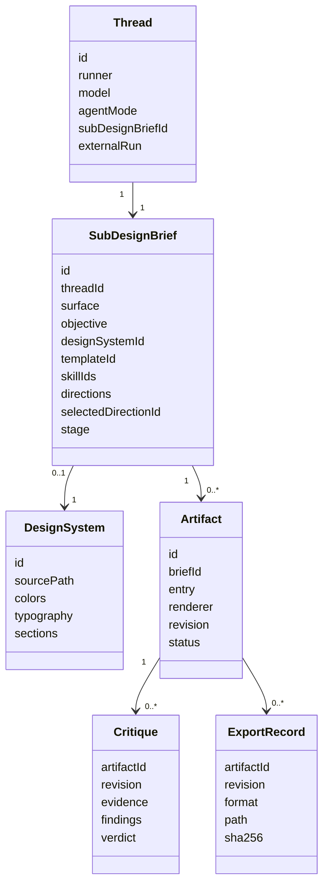
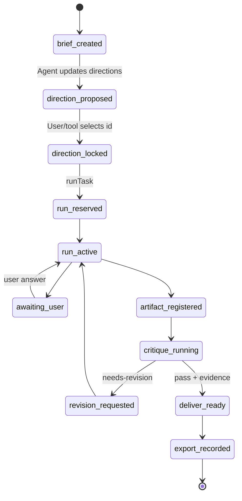
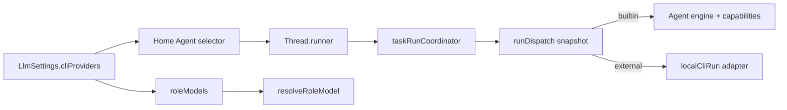

# SubDesign × Open Design 物件、事件與工具關聯圖

日期：2026-07-15

## 1. Domain object graph

## 2. UI action → event → owner → side effect

| UI action | Domain event / command | Canonical owner | Tool / boundary | Result |
| --- | --- | --- | --- | --- |
| 建立設計 | `createThread` + `createBrief` | `threadStore`, `subDesignStore` | local metadata persistence | 產生 Project route |
| 選 Agent | set `runner` before create | `Thread.runner` | `runDispatch` | 選 builtin 或 CLI runner |
| 選 Design System | `updateBrief(designSystemId)` | `SubDesignBrief` | DESIGN.md scanner/read | prompt 與 review 共用契約 |
| 選 Direction | `selectDirection` | `SubDesignBrief` | `design_direction_select` | stage 進入 build，write gate 解鎖 |
| Start Agent | `runTask` | coordinator + run registry | builtin loop / external CLI | 產生 run-scoped activity |
| Agent 更新 brief | `design_brief_update` | `subDesignStore` | tool executor | 保存 audience/criteria/directions/stage |
| 登記 Artifact | `design_artifact_register` | artifact store | Electron metadata IPC | 產生可預覽 revision |
| Patch/Tweak | patch command | artifact store | approval + exact patch IPC | 新 revision，舊 critique 失效 |
| Preview | read artifact | renderer state | `subdesign:readArtifact` | sandbox iframe/source view |
| Critique | two-round `runTask` | critique/session stores | capture/lint/note/critique tools | evidence-bound verdict |
| Export | export command | export store | HITL + Electron export bridge | file + hash + audit record |

## 3. Event lifecycle

## 4. Tool authority matrix

| Tool group | Examples | Before direction | During build | Critique | Approval |
| --- | --- | ---: | ---: | ---: | --- |
| Brief metadata | `design_brief_update` | allow | allow | read-mostly | no external side effect |
| Direction | `design_direction_select` | allow | allow | deny | explicit user decision preferred |
| Workspace read | `workspace_read`, safe list/search | allow | allow | allow | no |
| Workspace write | write/bash write | deny | allow by mode/policy | deny | existing guard/HITL |
| Artifact mutation | register/patch/tweak | deny | allow | deny | patch/tweak approval |
| Evidence | capture/lint | unavailable without artifact | allow | allow | governed Electron IPC |
| Critique record | note/final critique | unavailable without artifact | normally no | allow | final call exactly once |
| Export | HTML/PDF/PPTX/MP4 | deny | deny until pass | pass only | always HITL |

## 5. Settings projection

UI 只列出 enabled + authorized 的 external runner；Built-in 永遠存在。模型、reasoning、sub-agent 開關仍由既有 settings owner 管理，SubDesign 不建立第二份 provider 設定。

## 6. Invariants

- `brief.threadId` 必須指向唯一 Thread；Project Studio 不建立第二條執行生命週期。
- Artifact `entry`、supporting files、evidence path 必須是 project-relative。
- `Critique.revision === Artifact.revision` 才能解鎖 Deliver。
- `Thread.runner` 在建立 Project 時固定；後續 run 從 linked Thread 讀取。
- Design System content 是 untrusted data，不能被當作高優先級 agent 指令。
- 外部 CLI success 不等於內建 DoD pass；UI 必須保留 capability honesty。
