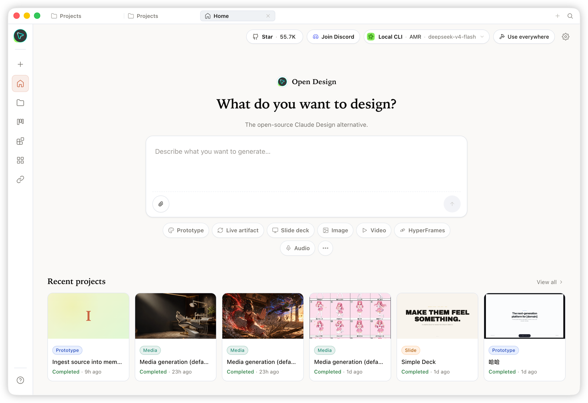
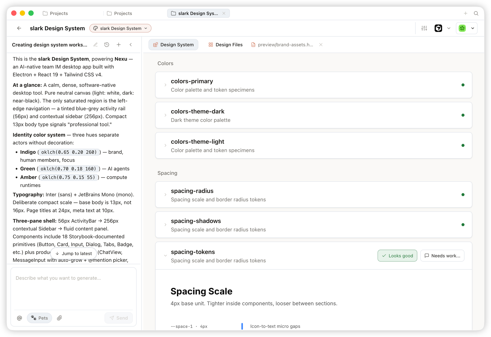
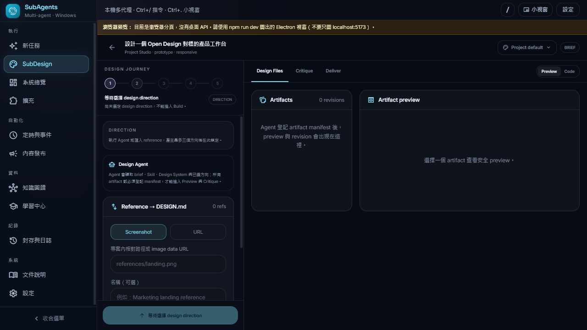
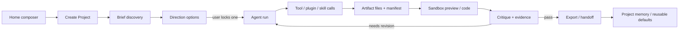
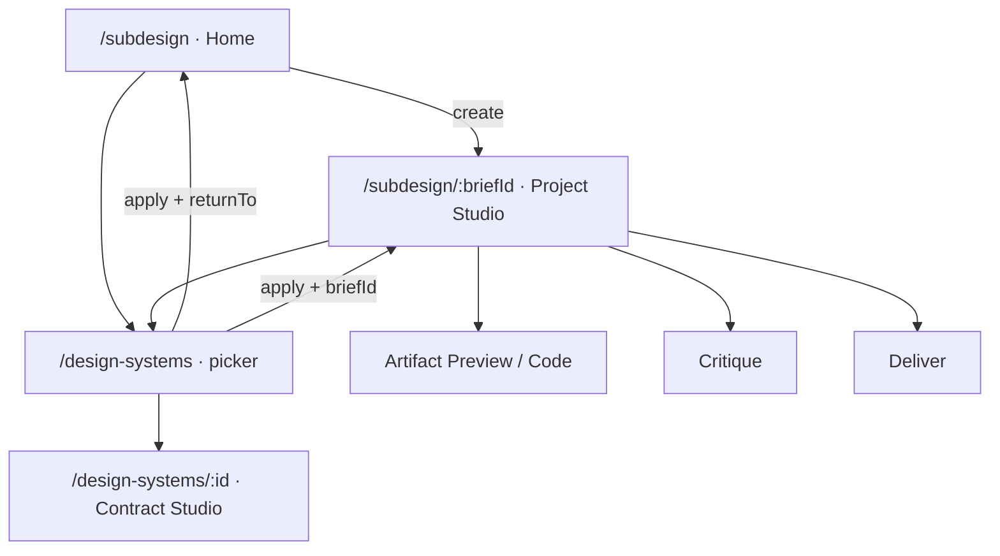
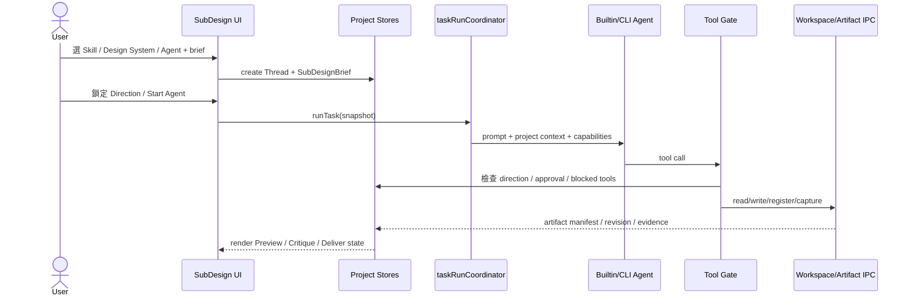

# SubDesign × Open Design IDE 圖文 Workflow Blueprint

日期：2026-07-15
上游：[`nexu-io/open-design`](https://github.com/nexu-io/open-design)
搭配閱讀：[`OPEN_DESIGN_IDE_SOURCE_RESEARCH_2026-07-15.md`](./OPEN_DESIGN_IDE_SOURCE_RESEARCH_2026-07-15.md)

## 1. 核心觀念

Open Design 不是「生成一張漂亮畫面」的工具，而是一個由本機 coding agent 驅動的 artifact IDE。它把一次設計工作拆成可保存的 Project，並讓 Skill、Design System、Plugin／Tool、Agent、Artifact、Critique 與 Export 都綁在同一個專案上下文。

> `Home` 負責建立 Project；`Studio` 負責把 Project 做完。Design System 是輸入契約，不是獨立的行銷頁；Artifact 是可執行檔案，不是聊天訊息裡的一段 code fence。

## 2. 官方畫面所表達的產品結構

### 2.1 Home：建立 Project

Home 的 composer 同時決定：

- artifact kind／plugin：要做 prototype、deck、image、video 或其他輸出。
- skill：Agent 應採用的設計方法與 taste。
- design system：所有輸出必須遵守的 `DESIGN.md`。
- agent／model：實際執行設計 loop 的本機 CLI 或 BYOK provider。
- brief：使用者的目標、受眾與限制。

Home 不顯示 Project 內部的 Critique、Export、檔案樹或執行 log；它只負責產生一個完整的 Project context。

### 2.2 Design System picker：Project 建立前的契約選擇

Design System picker 是 creation form 的一部分。其操作語意是 single-select、可搜尋、可選 freeform/default；選定後 id 寫入 Project metadata，Agent 每回合都由 Project 重新取得內容，而不是只在第一個 prompt 貼一次。

### 2.3 Project Studio：同一上下文完成所有回合

Studio 分成兩個主要責任區：

- 左側 Agent pane：對話、run state、事件流、direction decision、follow-up。
- 右側 Artifact pane：Design Files、Preview、Code、Critique、Comments、Export。

同一份 Project 可以持續產生 revision，也可以切換 artifact renderer；任何 follow-up 都沿用 Project 的 Skill、Design System、Agent session 與 artifact history。

### 2.4 Design System 本身也是 Studio

Design System 建立後不是一張 palette 卡，而是一個可由 Agent 修改、可預覽各區段、可留下 feedback 的 Project。右側把 `DESIGN.md` 轉成 Colors、Spacing、Typography、Components 等可檢查區段，左側仍可要求 Agent 修改契約。

### 2.5 本次落地的 Project Studio

此畫面由真實 browser flow 建立：Home brief gate 通過後產生 Thread + Brief，route 進入 `/subdesign/:briefId`。沒有 artifact 時顯示真實空狀態；Direction 未鎖定時 Agent write gate 與 Start action保持鎖定。

## 3. Canonical workflow

### 每個 gate 的 owner

| Gate | Canonical owner | 不可只存在於 |
| --- | --- | --- |
| Brief | `SubDesignBrief` | textarea local state |
| Direction | `selectedDirectionId` + direction objects | Agent 的自然語言回答 |
| Agent run | `runTask` + thread/run identity | loading spinner |
| Artifact | validated manifest + project-relative files | code fence |
| Critique | revision-bound scores/findings/evidence | 一句「看起來不錯」 |
| Deliver | export record + hash + source revision | download button toast |
| Memory | confirmed project preference | UI 預設值但無來源 |

## 4. SubDesign 正確的 route 分工

- `/subdesign`：只顯示 composer、選擇器、模板與最近 Project。
- `/subdesign/:briefId`：只顯示該 Project 的 Studio，不再重複「建立另一個設計」composer。
- `/design-systems`：creation context 裡的 picker/library。
- `/design-systems/:id`：可編輯品牌契約的 Studio。

## 5. Agent invocation sequence

## 6. UI 行為準則

1. 選擇器不是裝飾：每個選項都必須寫入 canonical Project object。
2. Agent 狀態不是頁面 boolean：必須由 `runId`／thread identity 派生。
3. Preview 與 Code 使用同一個 artifact revision，不能各讀不同來源。
4. Direction 未鎖定前，workspace write／artifact patch 必須被 tool guard 阻擋。
5. Critique 必須綁定 artifact id + revision；revision 改變後舊 verdict 失效。
6. Export 必須記錄來源 revision、格式、路徑、bytes 與 SHA-256。
7. Browser preview 沒有 Electron IPC 時要誠實降級，不顯示可成功寫檔的假控制。

## 7. 目前採用的實作方向

- Home 與 Project Studio 已切開。
- Project Studio 採左 Agent context、右 Artifact workspace。
- Agent selector 直接映射到 `Thread.runner`。
- Design System picker 直接映射到 `SubDesignBrief.designSystemId`。
- Direction cards 直接呼叫 store `selectDirection`，解鎖 Build gate。
- Preview／Code 共用 `ArtifactPreview` 讀到的同一份檔案內容。
- Critique／Deliver 沿用既有 revision-bound store 與 Electron IPC。
