# docs/ui × SubDesign 整合設計規格

日期：2026-08-22

## 目的

`docs/ui` 的十二份元件規格是同一個 task run 的不同視圖（見 `docs/ui/Lifecycle.md`）。本文件把它們逐一套用到 SubDesign 的每個 surface，定義「整合後長什麼樣」，並以 DEV prototype（`app/src/components/subdesign/SubDesignDocsUi.prototype.tsx`）產出實際截圖作為視覺證據。

App 的 theme 已內建 docs/ui primitive vocabulary（`app/src/index.css:49-94` 的 `ink`／`field`／`line`／`shadow-card` tokens 與 `fade-up`／`pop-in` keyframes），因此整合不需新增任何設計 token。

## 對照總表

| # | docs/ui 規格 | SubDesign surface | 整合重點 |
| --- | --- | --- | --- |
| 01 | Prompt Bar.md + Chat.md | 左欄 conversation composer | `@` 引用 brief 來源、`/` 呼叫 SubDesign 指令、附件 chips、模型 picker |
| 02 | Thinking.md | run 前段敘事（narrative → direction） | Steps 變體：整理 brief → 比較方向 → 生成 reference → 註冊 artifact；收起後留一行「思考完成 · N 秒」 |
| 03 | Tool Chips.md + Loading State.md | plugin 執行過程（build） | 工具呼叫列 + 檔案 diff chips；build 期間用 pixel loader（Drive）+ mono 計時 |
| 04 | Task Rows.md | lifecycle stages（brief → direction → build → critique → deliver） | List 變體卡：進度環、數量量欄、狀態 pill、可展開 detail |
| 05 | approve.md | 方向選擇與 awaiting_user 問答 | 單選 + 自訂答案 + ring-dot pager 的問卷卡，取代現有 direction grid fallback |
| 06 | Context Cards.md | 參考圖與 provenance（ReferenceImportPanel） | chunk 卡：標題列 + 摘要 + 來源 badge（PNG／MD），先於 artifact 呈現證據 |
| 07 | Streaming Text.md | Critique 回饋與 assistant 回覆 | 文字 blur-in、DESIGN.md citation chip、動作列、follow-ups |
| 08 | Diff Table.md | artifact revision 比較（r1 → r2） | 移除章節紅 tint 劃線、新增章節綠 tint；接受／拒絕分離 |
| 09 | Recommendation Card.md | Deliver gate 格式建議 | 信號 meter + alternatives drawer + 主要確認鍵；PDF／MP4 為可晉升選項 |
| 10 | Code Block.md | 匯出檔案預覽（export.html） | `data-token` 語法著色 + Copy；Preview／Code 切換共用同一份 |

Chat.md 的 tab＋composer 結構由 01（composer）與 07（訊息流）共同承擔，不另立 surface。

## Lifecycle grammar 套用

沿用 `docs/ui/Lifecycle.md` 的規則，對應到 SubDesign：

| Phase | Primary surface | SubDesign 對應 |
| --- | --- | --- |
| `starting` | Loading State | pixel loader 掛在 conversation pane 頂端，附 mono 計時 |
| `planning` | Thinking | Steps trace：整理 brief、比較方向 |
| `thinking` | Tool Chips | plugin 讀取 brief 與 references |
| `executing` | Tool Chips + Task Rows | Write deck.html、storybook capture、diff chips |
| `awaiting_user` | approve 卡 | 方向選擇、critique 問答；不使用 shimmer 假裝運算 |
| `responding` | Streaming Text | critique 結論與 follow-ups |
| `finalizing` | Diff Table + Recommendation Card | revision 差異表 → 交付格式建議 |
| terminal | Run Summary | 維持現有 RunSummaryCard，不再啟動動畫 |

## 實作檢查表（後續工程）

- [ ] Composer：把 `SubDesignConversationPane` 的 textarea 升級為 Prompt Bar 結構（`@` sources = references/storybook/DESIGN.md/project files/web；`/` commands = `/direction` `/critique` `/tweak` `/deliver`）。
- [ ] Run feed：`RunProcessFeed` 在 SubDesign context 改用 Thinking（Steps）+ Tool Chips 文法；plugin 執行列已有真實事件，只需換殼。
- [ ] 方向選擇：direction grid fallback 換成 approve 卡（保留 `McpAppSurface` 優先路徑與 `onChoice` 回寫 brief 不變）。
- [ ] Context Cards：`ReferenceImportPanel` 輸出改為 chunk 卡文法。
- [ ] Deliver：`ArtifactDeliveryPanel` 加 Recommendation Card（信號 meter + alternatives）；revision 切換加 Diff Table。
- [ ] 全部遵守：一個 run 一個狀態來源（`runId`）、live → terminal 只走一次、等待不是運算、動畫可中斷但內容不可消失。

## 視覺證據

截圖由 `app/scripts/capture-docsui-integration.mjs` 產生（dev server + Playwright，`#/subdesign?prototype=subdesign-docsui`）：

- 全頁總覽：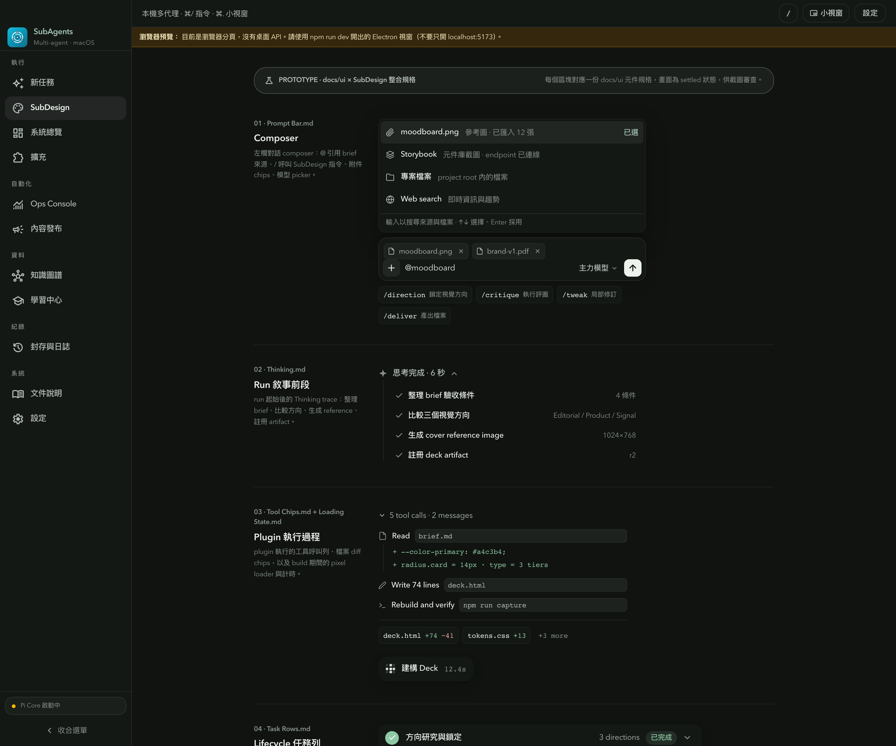
- 01 Composer：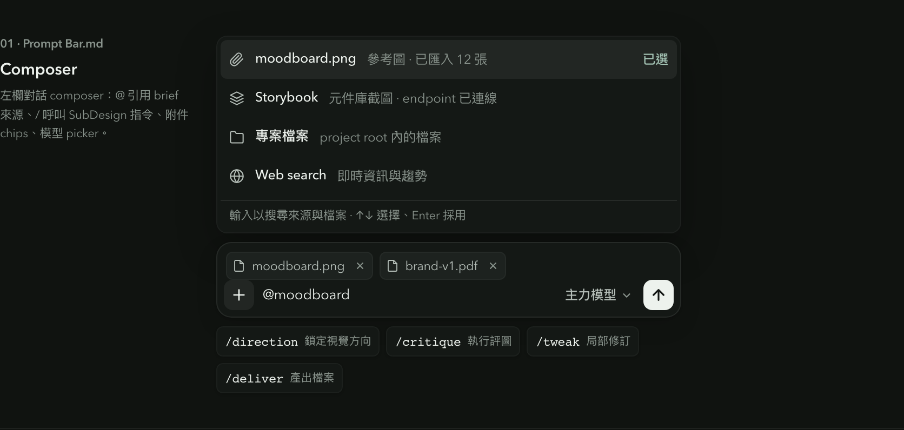
- 02 Thinking：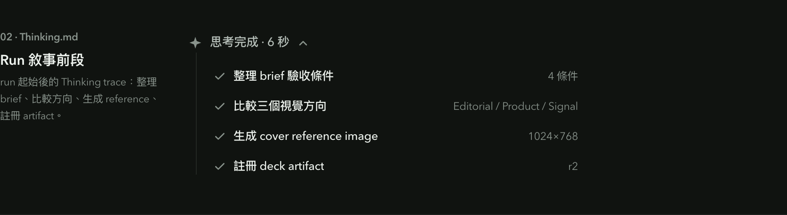
- 03 Tool Chips + Loading：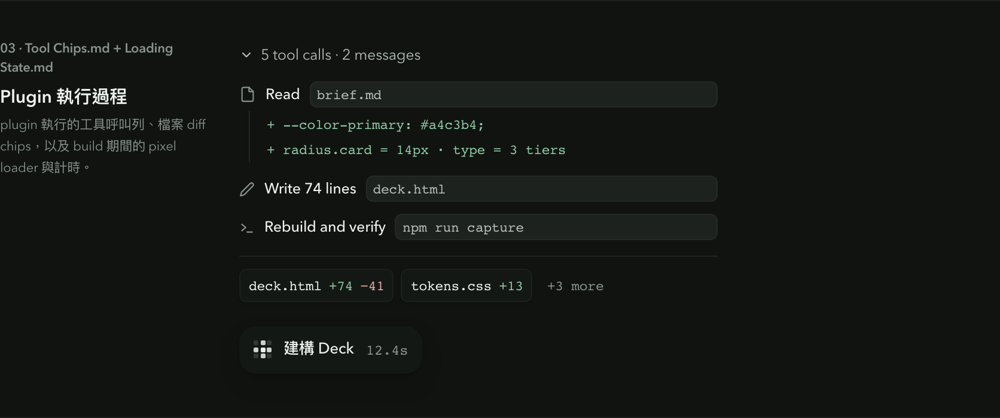
- 04 Task Rows：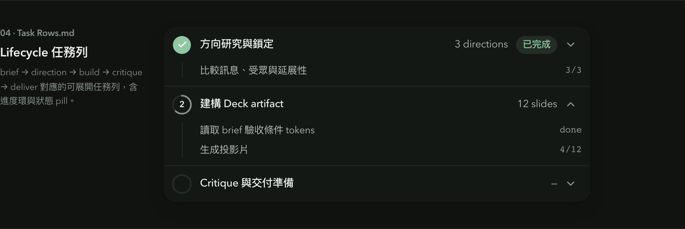
- 05 approve 方向卡：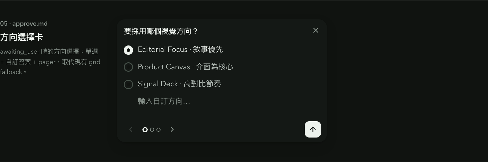
- 06 Context Cards：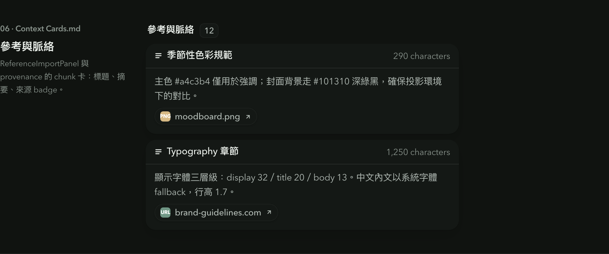
- 07 Streaming critique：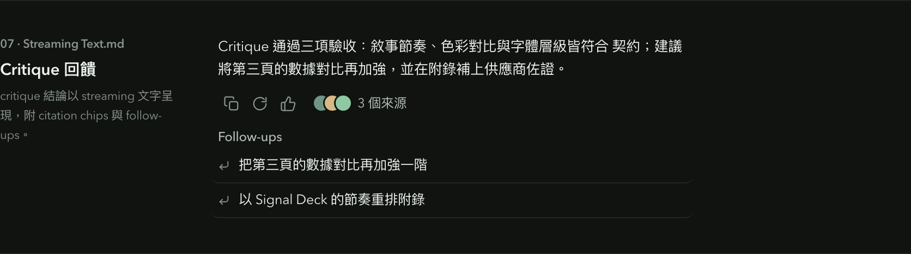
- 08 Diff Table：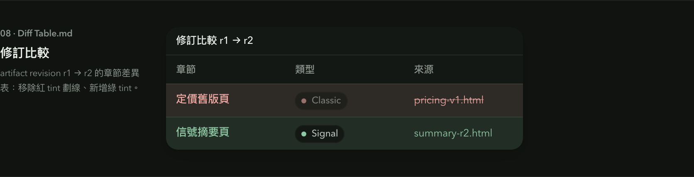
- 09 Recommendation：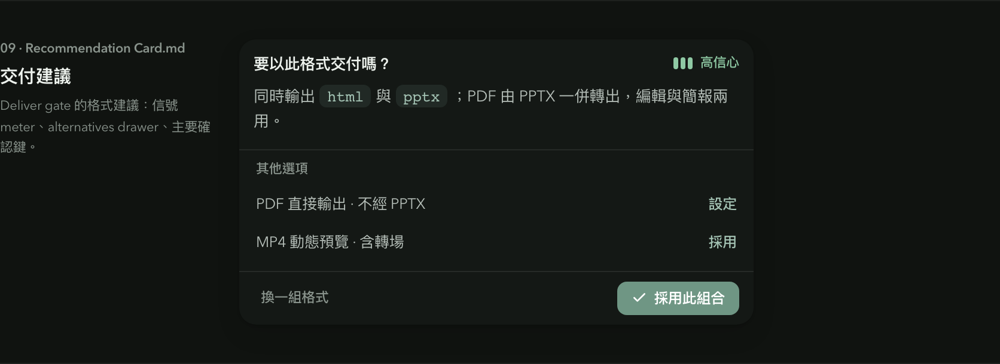
- 10 Code Block：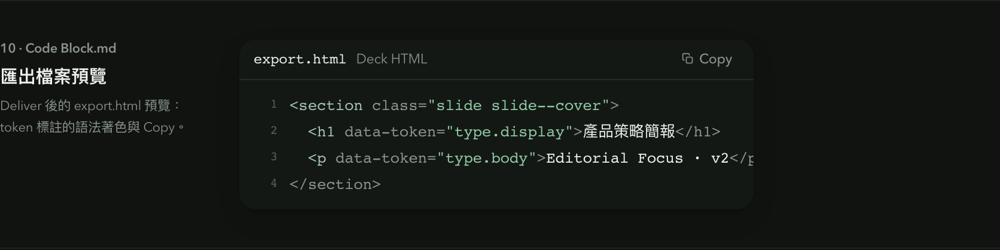

## 驗證限制

Prototype 為 DEV-only visual QA fixture，使用 deterministic 假資料呈現 settled 狀態，未接真實 run 事件。`npm run build`、`npx oxlint src` 通過；互動行為（@ 搜尋、pager、drawer 展開）在整合進 production 元件時需另以 smoke 驗證。
