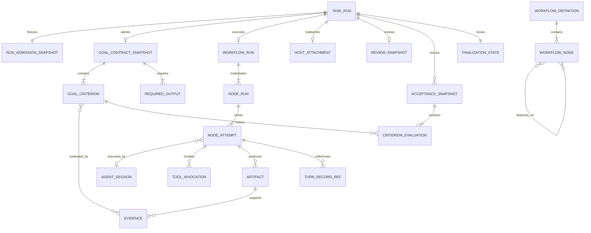

# AgentTeam Goal／Loop／Graph／Relationship／Lifecycle 修改計畫

- Repository：`tommy771004/AgentTeam`
- 建議文件位置：`docs/specs/AGENT_GOAL_LOOP_GRAPH_LIFECYCLE_PLAN_2026-09-01.md`
- 基準日期：2026-09-01
- 適用範圍：builtin Pi Core Host、external CLI adapter、child agents、Run Review、checkpoint／resume、renderer projections

## 0. 執行摘要

AgentTeam 已具備成熟的 Host authority、tool contracts、approval、evidence、memory、checkpoint、child-agent collaboration 與 exactly-once app finalization。此次修改不建立第二套 agent engine，也不把 renderer 變成 canonical owner；重點是補齊以下三個中間層：

1. **Executable Goal Contract**：Goal 必須有可執行、可失敗、可追溯的驗收條件。
2. **Acceptance-driven Loop**：每回合由 criterion verdict 與 evidence 決定下一步，而不是以「模型有回答」或模型自行提交 backlog 代表完成。
3. **Workflow DAG Runtime**：把既有 child-agent primitives 組成真正的 fan-out／fan-in graph，並以固定 output contract、fresh verifier 與 impacted-subgraph retry 收斂。

核心設計決策：**執行結束、Goal 通過、workflow 通過、app finalization 完成是四個正交狀態，禁止合併成單一 `success`。**

---

## 1. 目標與非目標

### 1.1 目標

- `answered` 只代表 model turn 有文字輸出，不再等於 Goal passed。
- Goal-based run 在 admission 後必須有至少一個可執行 criterion；否則明確標記 `unverifiable`。
- CHECK 由 Host-owned Acceptance Gate 執行；模型自評只能作為 repair hint，不能作為通過證據。
- 失敗 criterion 直接生成 repair targets，下一輪只修最弱且受影響的部分。
- Graph node 具明確 input/output contract；edge 必須對應實際資料依賴。
- 所有 ready nodes 可在容量與 workspace policy 允許下平行執行。
- Worker 與 semantic verifier 不共用 conversation；verifier 只收到 artifact、criterion、evidence refs 與 rubric。
- 現有 Turn Record、Review Snapshot、Host Attachment、checkpoint、finalization CAS 繼續各自擁有原本的 canonical scope。
- 支援 crash／reload／interrupt 後安全恢復，不重放已完成 side effects。

### 1.2 非目標

- 不重建 renderer-owned loop。
- 不把 external CLI exit code 當作 Goal verdict。
- 不讓模型或 renderer 直接簽發 execution evidence。
- 不以自由文字 `definitionOfDone` 直接執行任意 shell。
- 不讓 Workflow Graph 取代 Agent Tree；兩者描述不同關係。
- 不在第一階段支援任意分散式叢集；先以本機 Host、現有 queue 與 concurrency boundary 實作。

---

## 2. 現況基線與必修問題

### 2.1 現有 ownership 保留

| 範圍 | 現有 canonical owner | 修改後責任 |
|---|---|---|
| Task admission／capacity／thread bind／finalization | `taskRunCoordinator.ts` | 保留；只加入 Goal／Workflow snapshot admission 與新 outcome projection |
| Builtin model／tool loop | Pi Core Host | 保留；新增 Goal、Acceptance、Workflow lifecycle |
| Per-agent execution history | Turn Record | 保留；新增 goal/criterion/workflow references，不複製 tool transcript |
| Child agent execution與協作 | Agent Tree／Agent Collaboration | 保留；作為 workflow node 的 executor，不代表 dependency graph |
| Side-effect truth | Host adapter evidence | 保留；擴充 criterion binding |
| Historical code-change truth | Run Review Snapshot | 保留；可成為 criterion evidence |
| Reattachment／terminal settlement／app-finalization CAS | Pi Host Attachment | 保留；加入 Goal verdict 與 acceptance digest |
| Renderer | disposable projection | 保持 read-only projection，不可 author canonical Goal／Workflow state |

### 2.2 P0 缺陷：iteration 上限雙重來源

- Shared contract：`PI_MAX_ITERATIONS = 32`。
- 真正 `runPiOrchestration()` 仍以 literal `8` 截斷。

立即修改：

```ts
import { clampPiIterations } from '../src/agent/loopBounds.ts'

const limit = clampPiIterations(input.maxIterations ?? 1)
```

並增加 architecture test，禁止 builtin orchestration 再自行定義上限。

### 2.3 P0 語意缺陷：`answered → completed`

目前 turn settlement、agent lifecycle、run status、Goal outcome 有互相投影過度的問題。修改後：

- `PiTurnSettlement.answered`：provider/model call produced an answer。
- `AgentLifecycle.completed`：該 actor 的 execution 結束，仍是 observation only。
- `GoalVerdict.passed`：Acceptance Gate 以 criterion evidence 判定通過。
- `RunOutcome.success`：由 execution settlement + Goal verdict + execution kind 推導。

---

## 3. 目標資料模型與關聯

### 3.1 Canonical entities



### 3.2 關聯規則

1. **TaskRun ↔ Goal Contract**
   - Builtin Goal-based run：必須 1:1 綁定 immutable GoalContractSnapshot。
   - Turn-based run：可使用明確的 `assistant-answer-present` criterion，或 `goalVerdict=not-applicable`；不得暗中套用 Goal success。
   - External CLI：可作為 node executor；Goal verdict 仍由 Host Acceptance Gate 決定。

2. **Workflow Graph ↔ Agent Tree**
   - Workflow Graph：工作、資料依賴、output contract。
   - Agent Tree：runtime actor、parent-child、policy、workspace、mailbox。
   - `NodeAttempt.agentSessionId` 是兩者唯一直接關聯；禁止以 agent parent-child 關係推導 node dependency。

3. **Node ↔ Artifact**
   - 每個 machine-consumed output 都要有 `outputContract`。
   - downstream input 以 `artifactRef` 連結，不傳任意 parent transcript。
   - `dependsOn` 必須能由 input binding 或 barrier requirement 解釋；沒有資料流的 edge 產生 `fake-edge` warning。

4. **Agent result ↔ Goal**
   - `AgentTerminalResult.observationOnly` 保留。
   - Child `completed` 只產生 observation；parent checker/adoption 或 Acceptance Gate 通過後，才可更新 criterion／Goal。

5. **Evidence ↔ Criterion**
   - Evidence immutable；pass/fail/invalidated 是 evaluation 的狀態，不修改原 evidence。
   - 一個 evidence 可支援多個 criteria；一個 criterion 可要求多個 evidence。
   - 只有 adapter／Host checker 可簽發 trusted evidence。

6. **Turn Record ↔ Workflow Record**
   - Turn Record：單一 session 內模型、工具、approval、evidence 的 ordered account。
   - Workflow Record：跨 node 的 orchestration metadata；只存 Turn Record range refs，不複製完整 transcript。

7. **Review Snapshot ↔ Acceptance**
   - Review snapshot 可提供 immutable changed-files／verification evidence。
   - 若 Goal criterion 要求 review/build/test，Acceptance Gate 必須引用對應 snapshot revision；不可讀取目前 working tree 代替歷史 run。

---

## 4. 正交 Lifecycle 設計

## 4.1 TaskRun lifecycle（Coordinator-owned）

```text
created
  → admission_pending
  → admitted
  → dispatching
  → running
  → terminal_received
  → finalization_claimed
  → finalizing
  → finalized
  → released
```

分支：

```text
admission_pending → queued
admission_pending → admission_failed
running → recovery_pending
running → interrupted / cancelled
finalization_claimed → lease_expired → recovery_pending
```

不變量：

- `runTask` 仍是唯一 ingress。
- `finalizeTaskRun` 仍是 thread summary、afterRun、archive、metrics、release、queue drain 的唯一出口。
- 只有 finalization claim holder 可執行 app effects。
- `released` 不代表 Goal passed，只表示 capacity 與 queue lifecycle 已關閉。

## 4.2 Turn／Execution lifecycle（Host/runner-owned）

保留 `PiTurnSettlement`：

```text
answered | empty | truncated | failed | cancelled | interrupted
```

新增正交執行結果：

```ts
type RunExecutionSettlement =
  | 'completed'     // runner/execution infrastructure completed
  | 'failed'
  | 'cancelled'
  | 'interrupted'
```

映射原則：

- `answered`／`empty` → execution `completed`，但 Goal verdict 未知。
- `truncated`／`failed` → execution `failed`。
- `cancelled`／`interrupted` 維持各自語意。

## 4.3 Goal lifecycle（Host Acceptance-owned）

```text
draft
  → compiled
  → admitted
  → active
  → checking
      ├─ passed
      ├─ unmet → repairing → active
      ├─ blocked
      ├─ unverifiable
      ├─ failed
      └─ exhausted
```

中止分支：

```text
active/checking/repairing → cancelled
active/checking/repairing → interrupted
```

建議型別：

```ts
type GoalPhase =
  | 'compiled'
  | 'admitted'
  | 'active'
  | 'checking'
  | 'repairing'
  | 'settled'

type GoalVerdict =
  | 'passed'
  | 'failed'
  | 'blocked'
  | 'unverifiable'
  | 'exhausted'
  | 'cancelled'
  | 'interrupted'
  | 'not-applicable'
```

不變量：

- 只有 Acceptance Gate 可寫 terminal Goal verdict。
- Goal-based run 沒有 executable criterion 時，必須 `unverifiable`，不得以 `answered` 代替。
- `unmet` 是 iteration verdict，不是 terminal verdict；尚有 budget 時進入 `repairing`。
- `passed` 必須引用 AcceptanceSnapshot digest。

## 4.4 Criterion lifecycle

```text
pending
  → evaluating
      ├─ passed
      ├─ failed
      ├─ blocked
      └─ invalidated
```

- `invalidated` 後回到 `pending`，觸發 impacted repair。
- 每次 evaluation 產生新 immutable record，不覆寫歷史 verdict。
- `failed` 必須帶 `reason`、`evidenceRefs`、`repairHint` 或 `nonRetryableReason`。

## 4.5 Evidence lifecycle

```text
issued
  → bound
  → evaluated
      ├─ accepted
      ├─ rejected
      └─ invalidated
```

- Evidence 本體不變；狀態存在 evaluation／binding record。
- File evidence 在後續 write 改變 hash 時，產生 invalidation event。
- Command/test evidence 必須綁定 command registry id、cwd、revision、exit code 與 output digest。
- Semantic verifier verdict 不是 execution evidence；它是 verifier evidence，必須標示 verifier identity、rubric digest 與 fresh-context proof。

## 4.6 Workflow lifecycle

```text
draft
  → validating
  → validated
  → admitted
  → running
  → converging
  → verifying
      ├─ passed
      ├─ repairing → running
      ├─ blocked
      ├─ failed
      └─ exhausted
```

Graph admission 必須檢查：

- node id 唯一；
- 無 cycle；
- input refs 可解析；
- output contract 可驗證；
- required terminal nodes 可達；
- write node workspace policy 可證明；
- concurrency／cost budget 有上限。

## 4.7 Node／Attempt lifecycle

```text
pending
  → ready
  → leased
  → running
  → produced
  → verifying
      ├─ passed
      ├─ retryable_failed → ready(new attempt)
      ├─ failed
      ├─ blocked
      └─ cancelled
```

規則：

- Retry 建立新的 `attemptId`，舊 attempt immutable。
- `NodeRun.status` 是 latest projection；歷史以 Workflow Record 為準。
- 所有 dependencies passed 且 input artifacts 可解析時才可 `ready`。
- fan-in node 必須等待所有 required upstream nodes passed。
- 一個 node fail 時，只 invalidate downstream impacted subgraph，不重跑無關 node。

## 4.8 Agent lifecycle

保留現有：

```text
admitted → queued → running ↔ waiting-approval
running → blocked / completed / failed / cancelled / interrupted
```

修改語意：

- `completed` 明確改名為文件語意「actor execution completed」，不是 Goal passed。
- 新增 `nodeRunId?`、`attemptId?` correlation fields。
- `agentLifecycleFromTurnSettlement` deprecated；新增 `agentLifecycleFromExecutionSettlement`。
- Agent lifecycle 不再被 UI 直接投影成 Goal 成功。

## 4.9 Tool lifecycle

現有 lifecycle 保留：

```text
start → decision(allow|ask|deny) → update* → result → settlement
```

新增：

- `nodeRunId`、`attemptId`、`criterionCandidateIds` correlation。
- effectful success 可產生 Evidence；transport success 不自動產生 Goal evidence。
- approval denied、not-executed、failed 必須保持不同 terminal settlement。

## 4.10 App finalization lifecycle

保留 Host Attachment CAS：

```text
execution active
  → attachment terminal
  → finalization available
  → claimed(epoch + lease)
  → app effects
  → completed
  → acknowledged
  → pruned
```

修改 terminal attachment payload：

```ts
{
  turnSettlement,
  executionSettlement,
  goalVerdict,
  goalContractDigest,
  acceptanceDigest,
  workflowRunId?,
  workflowVerdict?,
  stopReason,
  finalization
}
```

重要：renderer 的 `finalizeComplete` 只能確認 app effects；不能改寫 Host 已決定的 Goal verdict。

---

## 5. Goal Contract

### 5.1 建議型別

```ts
type GoalCriterion =
  | {
      id: string
      kind: 'assistant-answer-present'
    }
  | {
      id: string
      kind: 'file-content'
      path: string
      sha256: string
    }
  | {
      id: string
      kind: 'registered-command'
      commandId: string
      expectedExitCode: number
    }
  | {
      id: string
      kind: 'test-suite'
      suite: 'build' | 'lint' | 'smoke' | 'test'
    }
  | {
      id: string
      kind: 'json-schema'
      artifactId: string
      schemaId: string
    }
  | {
      id: string
      kind: 'review-verification'
      verification: 'build' | 'smoke' | 'test'
    }
  | {
      id: string
      kind: 'source-set'
      minimumSources: number
      requireResolvableUrls: boolean
      freshnessDays?: number
    }
  | {
      id: string
      kind: 'semantic-rubric'
      rubricId: string
      verifierPolicy: 'all' | 'majority' | 'mandatory'
    }
  | {
      id: string
      kind: 'human-approval'
      approvalType: string
    }

type GoalContractSnapshot = Readonly<{
  schemaVersion: 1
  id: string
  revision: number
  digest: string
  mode: 'turn' | 'goal'
  objective: string
  constraints: string[]
  outputs: Array<{ id: string; schemaId: string; required: boolean }>
  criteria: GoalCriterion[]
  budgets: {
    maxIterations: number
    maxWallClockMs: number
    maxTokens?: number
    maxCostUsd?: number
    maxNodeAttempts?: number
  }
  escalation: {
    onBlocked: 'hitl' | 'fail'
    onUnverifiable: 'hitl' | 'fail'
    onBudgetExceeded: 'checkpoint' | 'fail'
    onNoProgress: 'hitl' | 'fail'
  }
}>
```

### 5.2 Admission 規則

- Explicit typed `workingGoal` 轉為 GoalContract criterion。
- Plan mode 的 `complete_plan` 擴充為提交 executable criteria，不只文字 acceptance criteria。
- 文字 DoD 可保留作 display/rubric source，但沒有 checker mapping 時不得假裝 executable。
- 任意 command 不允許直接放進 Goal Contract；只能引用 Host-registered verification command。
- Goal Contract 在第一個 provider call 前由 Host validate、freeze、digest、record。

---

## 6. Acceptance Gate 與 repair loop

### 6.1 AcceptanceSnapshot

```ts
type CriterionVerdict = Readonly<{
  criterionId: string
  status: 'passed' | 'failed' | 'blocked' | 'invalidated'
  evidenceRefs: string[]
  reason: string
  repairHint?: string
  retryable: boolean
}>

type AcceptanceSnapshot = Readonly<{
  schemaVersion: 1
  runId: string
  iteration: number
  goalContractDigest: string
  workflowRevision?: number
  verdicts: CriterionVerdict[]
  overall: 'passed' | 'unmet' | 'blocked' | 'unverifiable' | 'failed'
  weakestCriterionId?: string
  impactedNodeIds: string[]
  digest: string
  evaluatedAt: number
}>
```

### 6.2 每回合流程

```text
EXECUTE
  → settle tool/node effects
  → revalidate old evidence
  → deterministic criteria checks
  → fresh semantic verifier checks（需要時）
  → AcceptanceSnapshot
      ├─ passed → Goal passed
      ├─ blocked/unverifiable → policy escalation
      ├─ unmet + budget → repair plan
      └─ unmet + no budget → exhausted
```

### 6.3 Repair 規則

- `record_continuation_items` 從 canonical backlog 降級為 model proposal。
- Host 以 failed criteria、artifact dependency、node impact 生成 canonical RepairPlan。
- 每輪優先修正 weakest criterion；若同一 acceptance digest、artifact digest 與 evidence revision 連續兩輪不變，判定 no-progress。
- No-progress 不只比 continuation text signature。
- Graph mode 僅重跑 impacted nodes 及其 downstream；單 agent mode生成 bounded next prompt。

---

## 7. Workflow Graph

### 7.1 Definition

```ts
type WorkflowNode = Readonly<{
  id: string
  kind: 'agent' | 'deterministic-reducer' | 'verifier' | 'human-gate'
  task: string
  dependsOn: string[]
  inputs: Array<{ name: string; artifactRef: string; required: boolean }>
  outputs: Array<{ id: string; schemaId: string; required: boolean }>
  runner: {
    preferred?: string
    requiredCapabilities: string[]
    workspaceMode: 'shared-readonly' | 'shared-leased-write' | 'isolated-worktree'
  }
  verifier?: {
    freshContext: boolean
    rubricId?: string
    quorum?: { pass: number; total: number }
  }
  retry: {
    maxAttempts: number
    retryOn: Array<'execution-failed' | 'schema-failed' | 'criterion-failed'>
  }
}>

type WorkflowDefinition = Readonly<{
  schemaVersion: 1
  id: string
  revision: number
  digest: string
  nodes: WorkflowNode[]
  terminalNodeIds: string[]
  budgets: {
    maxConcurrentNodes: number
    maxTotalAttempts: number
    maxWallClockMs: number
  }
}>
```

### 7.2 Scheduler

- `ready = pending nodes where all required upstream passed and input artifacts exist`。
- 以現有 run capacity、same-thread order、workspace lease、isolated worktree constraints 進行 admission。
- 讀取型 nodes 可 fan-out；寫入型 nodes 必須依 workspace policy lease 或 isolated worktree。
- fan-in node 只在全部 required inputs verified 後 dispatch。
- deterministic reducer 不使用模型，負責 normalize、deduplicate、schema validation。
- verifier node 只接受 artifact + criteria，不接受 worker history。

### 7.3 Workflow Record

新增 Host-owned append-only metadata ledger：

```ts
type WorkflowRecordEntry =
  | { kind: 'workflow-admitted'; definitionDigest: string }
  | { kind: 'node-ready'; nodeRunId: string }
  | { kind: 'node-dispatched'; nodeRunId: string; attemptId: string; agentSessionId?: string }
  | { kind: 'node-settled'; nodeRunId: string; attemptId: string; settlement: string }
  | { kind: 'artifact-published'; artifactId: string; digest: string }
  | { kind: 'criterion-evaluated'; acceptanceDigest: string; criterionId: string }
  | { kind: 'barrier-opened'; nodeId: string; upstreamArtifactIds: string[] }
  | { kind: 'goal-verdict'; verdict: GoalVerdict; acceptanceDigest: string }
  | { kind: 'budget-updated'; remaining: Record<string, number> }
```

每筆 entry 包含：

```text
workflowSeq, at, taskRunId, workflowRunId,
nodeRunId?, attemptId?, sessionId?, runId?,
turnRecordRef?, reviewSnapshotRef?
```

---

## 8. 修改檔案關聯矩陣

### 8.1 新增檔案

| 檔案 | 責任 |
|---|---|
| `app/src/agent/goalContract.ts` | GoalContract types、guards、digest、legacy mapping |
| `app/src/agent/goalOutcome.ts` | execution settlement、Goal verdict、stop reason、derived run outcome |
| `app/src/agent/acceptanceContract.ts` | CriterionVerdict／AcceptanceSnapshot shared types |
| `app/electron/acceptanceGate.ts` | Host-owned criterion orchestration與 overall verdict |
| `app/electron/criterionCheckers/fileContent.ts` | 現有 file SHA checker extraction |
| `app/electron/criterionCheckers/registeredCommand.ts` | command/test checker，僅允許 registry id |
| `app/electron/criterionCheckers/reviewVerification.ts` | Run Review revision-bound checks |
| `app/electron/criterionCheckers/semanticVerifier.ts` | fresh-context verifier dispatch |
| `app/src/agent/workflowGraph.ts` | graph definition、validation、cycle/input/output checks |
| `app/src/agent/workflowRecord.ts` | append-only workflow event vocabulary |
| `app/electron/workflowScheduler.ts` | ready-set、fan-out/fan-in、retry、budget |
| `app/electron/workflowRecordStore.ts` | durable workflow metadata store |
| `app/src/agent/lifecycleOutcome.ts` | UI／journal／archive 共用的正交 outcome projection |

### 8.2 修改檔案

| 現有檔案 | 修改 |
|---|---|
| `app/electron/piOrchestrationExtension.ts` | 使用 shared clamp；由 AcceptanceSnapshot 驅動 done／nextPrompt |
| `app/src/agent/piHostRun.ts` | 停用「answered = Goal DoD」；新增 execution/goal outcome contract |
| `app/electron/piHostProtocol.ts` | Goal admission、Acceptance Gate、Workflow scheduler、events、protocol fields |
| `app/src/agent/workingState.ts` | v2：goalContractRef、criterion states、workflow ref；保留 v1 reader |
| `app/src/agent/continuation.ts` | `selectReadyContinuationItems()`；model backlog 改為 proposal |
| `app/src/agent/turnRecord.ts` | format v15+：goal-contract、criterion-evaluation、goal-verdict、workflow refs |
| `app/src/agent/agentLifecycle.ts` | completed 改為 execution semantics；新增 node/attempt refs與新 mapping |
| `app/electron/piHostRunDomain.ts` | queue settlement 不再以 turn settlement推導 Goal success |
| `app/src/agent/agentCollaboration.ts` | terminal result 加 node/attempt refs；維持 observationOnly |
| `app/electron/piAgentCommunicationDomain.ts` | spawn/follow-up/wait 與 node attempt correlation |
| `app/src/agent/runners/types.ts` | capability matrix新增 Goal／Graph／Verifier能力；external保持誠實 |
| `app/electron/piHostAttachment.ts` | terminal payload加入 execution/goal/workflow/acceptance facts |
| `app/src/agent/taskRunCoordinator.ts` | finalization input/output加入 Goal verdict；不改 exactly-once order |
| `app/src/agent/runLifecycle.ts` | 改由 execution + goal + finalization 三軸推導 UI |
| `app/src/agent/runJournal.ts` | schema v2；不再只存 status + dodMet |
| `app/src/agent/compactionCheckpoint.ts` | 保存 Goal contract、Acceptance、Workflow、budget、artifact refs |
| `app/electron/compactionCheckpointStore.ts` | 新 schema、claim/resume migration |
| `app/electron/review*` | Review evidence 可被 criterion 引用，維持 snapshot revision binding |
| `app/src/store/agentStore.ts` | AgentState 投影新 outcome；不再把 answered直接呈現 success |
| `app/src/store/runActivityStore.ts` | 顯示 checking／repairing／converging／unverifiable 等 phase |
| `docs/CONVERSATION_LOOP_HERMES_FLOW.md` | 更新 canonical flow、Goal vs execution vocabulary |
| `CONTEXT.md` | 新增 Goal Contract／Acceptance Gate／Workflow Graph 定義與 Avoid 條款 |

---

## 9. 分階段實作／PR 計畫

## PR-01：修正 iteration contract 與語意基線（P0）

修改：

- `piOrchestrationExtension.ts`
- `loopBounds.ts`
- tests／architecture guards
- `CONTEXT.md`

DoD：

- requested 1、8、16、32 的 Host 實跑上限與 UI／journal 一致。
- 不再存在 builtin literal cap。
- 現有 smoke 全通過。

## PR-02：新增正交 Outcome vocabulary（P0）

新增／修改：

- `goalOutcome.ts`
- `agentLifecycle.ts`
- `runLifecycle.ts`
- `piHostRunDomain.ts`
- `types.ts`

DoD：

- `answered` 可以與 `goalVerdict=failed|unverifiable|exhausted` 同時存在。
- Child `completed` 不會使 parent Goal pass。
- 所有 UI surface 使用同一 `deriveRunOutcome()`。

## PR-03：Goal Contract admission（P1）

新增／修改：

- `goalContract.ts`
- `piHostProtocol.ts`
- `piHostRun.ts`
- Plan Gate tool schema
- `RuntimeOverrides`／protocol types

DoD：

- Goal-based run 無 executable criterion 時 fail closed 為 `unverifiable`。
- Existing `workingGoal:file-content` 可無損轉換。
- Contract 在 provider call 前 freeze、digest、寫入 Turn Record。

## PR-04：Acceptance Gate + deterministic criteria（P1）

新增／修改：

- `acceptanceGate.ts`
- checker modules
- `workingState.ts` v2
- `turnRecord.ts` v15
- `piHostProtocol.ts`

首批 criteria：

- assistant-answer-present（Turn only）
- file-content
- registered-command
- test-suite
- json-schema／artifact-exists

DoD：

- 每輪產生 AcceptanceSnapshot。
- Goal passed 必須引用 acceptance digest。
- Evidence invalidation 會撤銷舊 pass。

## PR-05：Criterion-driven repair loop（P1）

修改：

- `continuation.ts`
- `piHostProtocol.ts`
- orchestration prompts／tools

DoD：

- 下一輪由 failed criteria 與 impacted artifacts 產生。
- 同一 acceptance/artifact/evidence digest 連續兩輪不變時停止 no-progress。
- Model continuation items 僅為 proposal，Host 可拒絕或改寫。

## PR-06：Lifecycle persistence 與 exactly-once finalization integration（P1）

修改：

- `piHostAttachment.ts`
- `taskRunCoordinator.ts`
- `runJournal.ts` v2
- `runLifecycle.ts`
- startup recovery

DoD：

- attachment terminal 具 executionSettlement、goalVerdict、acceptanceDigest。
- finalization claim/complete/ack 不改變 Goal truth。
- Crash 於 execution terminal 後、app finalization 前可恢復且只執行一次 app effects。

## PR-07：Workflow Graph contracts + validator（P2）

新增：

- `workflowGraph.ts`
- graph validation tests
- protocol schema

DoD：

- cycle、missing ref、duplicate output、unreachable terminal、invalid workspace policy fail closed。
- dependsOn 無資料 binding 產生 fake-edge warning。
- 定義可 freeze、digest、持久化。

## PR-08：Workflow scheduler + Workflow Record（P2）

新增／修改：

- `workflowScheduler.ts`
- `workflowRecord.ts`
- `workflowRecordStore.ts`
- Agent Communication bridge

DoD：

- 所有 ready nodes 可依 maxConcurrentNodes 平行 dispatch。
- fan-in barrier 等待 required inputs。
- Node retry 使用新 attemptId。
- 只重跑 impacted subgraph。
- Turn Record 與 Workflow Record 無重複 canonical payload。

## PR-09：Fresh verifier nodes（P2）

新增／修改：

- semantic verifier checker
- verifier runner profile
- outbound/context policy
- source/freshness/URL checkers

DoD：

- verifier payload assertion證明不含 worker transcript/history/reasoning。
- correctness、freshness、source validity 可平行執行。
- quorum policy deterministic。
- verifier cost 計入 Goal budget。

## PR-10：Checkpoint／resume／recovery（P2）

修改：

- `compactionCheckpoint.ts`
- checkpoint store
- `resumeWorkingState`
- workflow scheduler recovery

DoD：

- checkpoint 保存 exact GoalContract identity、AcceptanceSnapshot、node attempts、artifacts、remaining budgets。
- Resume 必須 re-admit exact contract digest 與 governing package。
- 新 completed effects、artifact drift、evidence invalidation時拒絕 replay-safe resume。

## PR-11：Review／UI／metrics／docs（P3）

修改：

- Review integration
- AgentStore／RunActivity／summary cards／archive
- metrics
- docs

DoD：

UI 可明確區分：

- 模型已回答
- 執行已完成，Goal 驗收中
- Goal 已通過
- Goal 未通過
- Goal 被阻擋
- Goal 無法驗證
- Goal 用盡 budget
- App finalization 待恢復

---

## 10. Protocol、記錄格式與 migration

### 10.1 Pi Host Protocol

- 建議由 v5 升至 v6。
- 新 capability：
  - `goal-contract-v1`
  - `acceptance-gate-v1`
  - `workflow-graph-v1`
  - `workflow-record-v1`
- v5 peer 可讀 legacy sessions，但不能宣告新 Goal/Graph guarantees。

### 10.2 Turn Record

- v15：GoalContractSnapshot、criterion evaluation、Goal verdict。
- v16：Workflow refs／node attempt refs。
- 舊 record 不回填 Goal passed；標記 `legacy-unverified`。

### 10.3 WorkingState

建議採 versioned union：

```ts
type WorkingState = WorkingStateV1 | WorkingStateV2
```

- V1 保持 read-only compatibility。
- 新 run 僅寫 V2。
- UI 透過 projection 將 criterion state映射為既有 goal rows。

### 10.4 Run Journal v2

新增：

```ts
executionSettlement?: RunExecutionSettlement
goalVerdict?: GoalVerdict
stopReason?: string
goalContractDigest?: string
acceptanceDigest?: string
workflowRunId?: string
workflowVerdict?: string
```

Legacy mapping 必須保守：

- `external + success` → execution completed、goal not-applicable。
- `loop + success + dodMet=true` → goal passed。
- `loop + success + dodMet=false` → goal exhausted/unmet。
- `loop + success + dodMet absent` → `legacy-unverified`，不得推定 passed。

### 10.5 Host Attachment

保留 active/terminal 與 finalization CAS；只增加 immutable terminal facts，不把 Workflow Record 或 Turn Record body 複製進 attachment。

---

## 11. Failure、cancel、interrupt、recovery 語意

| 情況 | Execution | Goal | Workflow | Finalization |
|---|---|---|---|---|
| Model answered，criterion fail，budget 尚有 | completed | repairing | running | 未開始 |
| Model answered，無 checker | completed | unverifiable | blocked/settled | 可 finalization |
| Tool failed，可 retry | completed/failed by policy | active | node retry | 未開始 |
| Iteration cap | completed | exhausted | exhausted | finalization |
| User stop | interrupted | interrupted | interrupted | finalization |
| Timeout | interrupted | interrupted/exhausted by policy | interrupted | finalization |
| Approval waiting | running | active | node blocked | 未開始 |
| Approval denied | completed or failed | blocked/failed | blocked/failed | finalization |
| Renderer crash after Host terminal | terminal immutable | immutable | immutable | claim recovery |
| Host child crash while active | interrupted | interrupted | interrupted | recovery finalization |
| Evidence later invalidated | completed | repairing/failed | impacted nodes invalidated | 若已 finalization，建立新 continuation run，不改寫歷史 |

歷史 run 永不被目前 workspace 狀態重寫；需要修正時建立新的 continuation TaskRun，並引用 prior Goal/Workflow snapshot。

---

## 12. Security 與 policy 約束

- Goal Contract 中的 command 只能引用 Host registry，禁止自由 shell。
- Fresh verifier 仍必須經 Outbound Data Gate；fresh context 不代表繞過 security context。
- Verifier 不取得 worker conversation，但可取得已 sanitize 的 artifact/evidence projection。
- External CLI node 遵守 frozen instruction、sandbox、connector、approval policy。
- Child policy只能等於或比 parent 更嚴格。
- Temporary chat：不得讀寫 durable memory；Workflow Record／Goal Record仍可作 run metadata，但不可沉澱個人/專案 memory。
- Semantic verifier 的 rubric、model、provider、context policy 需 freeze 並寫入 provenance。

---

## 13. Qualification test matrix

### 13.1 Goal／Loop

1. `answered` + criterion fail → run 不得顯示 Goal passed。
2. Goal-based + 無 executable criterion → `unverifiable`，不得無限 retry。
3. Turn-based answer → assistant-answer criterion pass 或 goal not-applicable。
4. file-content evidence pass；後續 write 改 hash後 invalidated。
5. registered-command exit 1 → criterion fail，repair target 明確。
6. maxIterations=16 實際執行 16；不得被 8 截斷。
7. budget exhausted → Goal exhausted，不得 plain success。
8. no-progress 依 acceptance/artifact/evidence digest 判定。
9. Model 自稱 DONE，但 Acceptance Gate fail → 不得停止為 passed。

### 13.2 Graph

10. 兩個無依賴 read nodes 實際執行時間重疊。
11. fan-in node 在所有 required upstream passed 前不可 dispatch。
12. cycle／missing artifact ref fail closed。
13. fake dependsOn edge 產生 warning。
14. 一個 branch fail，只重跑 impacted branch 與 downstream。
15. shared write conflict 由 lease／isolated worktree處理。
16. deterministic reducer schema mismatch 拒絕輸出。

### 13.3 Verifier

17. verifier request 不含 worker transcript、provider history、reasoning。
18. correctness/freshness/source checks 可平行。
19. quorum policy deterministic，mandatory criterion 不能被 majority 覆蓋。
20. URL/source checker 受 outbound policy 管理。

### 13.4 Lifecycle／Recovery

21. Child agent completed 不會直接完成 parent Goal。
22. terminal attachment 先於 app finalization；Goal truth immutable。
23. 兩個 renderer 同時 claim，只有一個 epoch owner。
24. claim holder crash，lease expiry後 recovery只執行一次 app effects。
25. finalization complete 前 ack 被拒絕。
26. checkpoint resume 不重放已完成 side effect。
27. contract digest／working revision mismatch 時 resume fail closed。
28. v1 journal／v14 Turn Record 可讀，但顯示 legacy-unverified。
29. external CLI exit 0 不得產生 Goal passed，除非 Host criteria通過。
30. Review snapshot revision drift時 criterion fail，不以 live working tree 補位。

---

## 14. Metrics 與可觀測性

新增：

- `execution_completion_rate`
- `goal_pass_rate`
- `goal_unverifiable_rate`
- `goal_exhausted_rate`
- `criterion_failure_rate{kind}`
- `evidence_invalidation_rate`
- `repair_success_rate`
- `iterations_to_pass`
- `accepted_artifacts / produced_artifacts`（keep rate）
- `workflow_parallelism_ratio`
- `fanout_width`
- `node_retry_rate`
- `impacted_subgraph_size`
- `verifier_tokens_per_passed_artifact`
- `finalization_recovery_rate`
- `finalization_claim_conflict_rate`

任何 rate 缺少 measured denominator 時不顯示 0；沿用現有「unknown ≠ zero」原則。

---

## 15. Rollout 策略

1. **先修語意，不先上 Graph**：PR-01～PR-06 完成後，單 agent Goal loop 已可靠。
2. **Protocol capability gate**：只有 v6 + negotiated capability 才啟用新 guarantees。
3. **Dual-read / single-write**：可讀 legacy，新的 builtin runs 僅寫新格式。
4. **Feature flag**：
   - `goalContractV1`
   - `workflowGraphV1`
   - `freshVerifierV1`
5. **Shadow evaluation**：初期 Acceptance Gate 可同時記錄舊 DoD 與新 verdict，但 UI 只在 flag 開啟後採用新 verdict。
6. **Fail closed**：schema、checker、artifact、revision、resume proof 任一缺失，不得推定 passed。
7. **移除舊路徑條件**：新 qualification 穩定後，刪除 `PI_CORE_SETTLEMENT_DEFINITION_OF_DONE` 作為 Goal success 的語意。

---

## 16. 建議最先執行的三個 PR

### 第一個 PR

- 修正 8／32 cap drift。
- 加 shared clamp smoke。
- 不碰 protocol schema。

### 第二個 PR

- 建立 `RunExecutionSettlement`、`GoalVerdict`、`RunStopReason`。
- 修改 AgentLifecycle／RunLifecycle projection。
- 先允許 legacy Goal verdict 為 `legacy-unverified`。

### 第三個 PR

- 加入 GoalContract + Acceptance Gate，先支援：
  - assistant-answer-present
  - file-content
  - registered-command
  - test-suite
- `answered` 正式與 Goal passed 分離。

完成前三個 PR 後，即使尚未導入完整 Graph，AgentTeam 的 Goal 與 Loop 語意已會從「模型回答驅動」轉為「可驗收證據驅動」，且不破壞現有 Host authority、Turn Record、Review Snapshot 與 exactly-once finalization。
